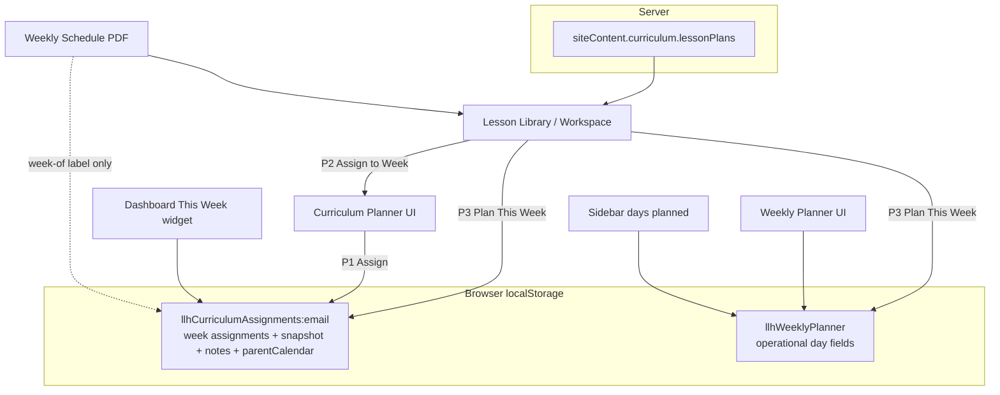
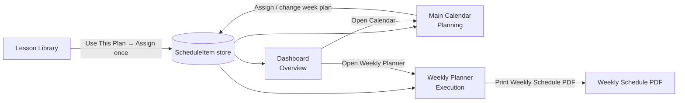

# Unified Calendar, Weekly Planner & Curriculum System

**Status:** Audit + Architecture complete — **awaiting approval before implementation**  
**Date:** July 13, 2026  
**Scope:** Architecture only. No product code changes in this deliverable.  
**Rule:** Curriculum Planner must **not** be deleted until migration + retirement steps below are approved and completed.

---

## Document map

| Phase | Section | Purpose |
|-------|---------|---------|
| **1** | [Current State Audit](#phase-1--current-state-audit) | What exists today |
| **2** | [Unified Architecture Plan](#phase-2--unified-architecture-plan) | Recommended source of truth + models |
| **3** | [UX Concepts](#phase-3--ux-concepts) | How surfaces connect (no visual redesign yet) |
| **4** | [Implementation Plan](#phase-4--implementation-plan) | Build order, migration, tests, risks |

**Related docs:** `CURRICULUM_CALENDAR_ROADMAP.md` (F1–F3 complete; cloud migration parked), `LESSON_LIBRARY_UX_IMPLEMENTATION_MAP.md`.

---

# PHASE 1 — Current State Audit

## 1.1 Verdict

The product **already has** a week-assignment system (Curriculum Planner F1–F3), but it **does not feel unified** because:

1. **Two planners coexist** with different storage and only partial sync.
2. **Three assignment entry points** do not all update the same views.
3. **“Calendar” naming is overloaded** — there is no real Main Calendar screen.
4. **Assignments are device-local** (`localStorage`), while lesson content is server-backed.
5. **Classroom / center / org hierarchy is stubbed** (`organizationId` / `classroomId` = `null`).

**One-sentence diagnosis:** Curriculum Planner is the closest thing to a scheduling source of truth today, but Weekly Planner, Dashboard metrics, and Lesson Library flows still behave like separate products.

---

## 1.2 Current architecture (views)

Vanilla JS SPA. Views toggle via `setView()` — no URL routes for in-app screens.

| Product name (nav / copy) | View ID | Mount | Render |
|---------------------------|---------|-------|--------|
| Dashboard | `home` | `#view-home` | `renderUserDashboard()` |
| Lesson Plan Library | `lessons` | `#view-lessons` | `renderCategoryPage("lessons")` |
| Weekly Planner | `planner` | `#weeklyPlannerApp` | `renderWeeklyPlanner()` |
| Curriculum Planner | `curriculum-planner` | `#curriculumPlannerApp` | `renderCurriculumPlanner()` |
| Lesson Workspace | modal (not a route) | `#resourceViewerModal` | `openResourceViewer()` / lesson workspace chrome |

**Nav order today (sidebar):** Dashboard → … → Lesson Plan Library → Weekly Planner → Curriculum Planner.

### What “Dashboard Calendar” actually is

Not a calendar month view. It is the **“This Week’s Curriculum”** widget (`dashboardCurriculumWeekMarkup()`), reading the **current ISO week** assignment from Curriculum Planner storage.

Legacy `dashboardCalendarMarkup()` (Weekly Planner day rows) still exists in `app.js` but is **unused** by the current dashboard.

### What “Main Calendar” is today

There is **no dedicated Main Calendar month view**. Product copy in the Lesson Workspace (“Plan This Week” / “main calendar”) means:

1. Write a Curriculum Planner week assignment, and
2. Sync day text into Weekly Planner.

That path is `addCurriculumLessonPlanToMainCalendar()` → `assignCurriculumLessonPlanToWeek()` + `applyCurriculumLessonToWeeklyPlanner()`.

---

## 1.3 Current data model

### A. Published lesson content (server — durable)

| Store | Location |
|-------|----------|
| Postgres `llh_store` JSONB (prod) or `server/data/launch-store.json` (local) | `siteContent.curriculum` |

```
siteContent.curriculum
├── lessonPlans[]     ← published Free/Pro plans (dailyPlans Mon–Fri, theme, books, songs, …)
├── activities[]      ← synced from plan items
└── resources[]       ← attached files
```

Public surface: `GET /api/site-content` → `curriculumLibrary` DTO.  
Full Pro plan: `GET /api/curriculum/lesson-plans/:id`.

Client maps these into `resources[]` via `loadCurriculumManagedLessonPlans()` (`_curriculumManaged`, `_curriculumLessonPlan`).

### B. Week assignments (client — device-local)

| Key | Scope | Role |
|-----|-------|------|
| `llhCurriculumAssignments:{email}` | Per logged-in email | **De facto source of truth** for “which lesson plan is assigned to which week” |

Assignment shape (normalized by `normalizeCurriculumWeekAssignment`):

```text
{
  id, weekStartDate (Monday ISO),
  ageGroup, classroomLabel,
  lessonPlanId, lessonPlanTitle, lessonPlanPlan, lessonPlanUpdatedAt,
  snapshot,                    // frozen copy of plan at assign time
  organizationId: null,        // stub
  classroomId: null,           // stub
  assignedBy, createdAt, updatedAt,
  // F2 teacher-private:
  teacherNotes, preparationNotes, dailyTeacherNotes{mon..fri},
  observations[],
  // F3 parent calendar (week-scoped, not a real calendar):
  parentCalendar: { parentMessage, classroomEvents[], updatedAt }
}
```

**Not on the server.** Cloud migration was already identified as the next calendar investment in `CURRICULUM_CALENDAR_ROADMAP.md`.

### C. Weekly Planner (client — separate)

| Key | Scope | Role |
|-----|-------|------|
| `llhWeeklyPlanner` | **Browser-global** (not email-scoped) | Operational Mon–Fri fields: circle, activity, meal, rest, support |

```text
{
  weekOf, ageGroup, theme, focus, notes, resourceId,
  days: { Monday..Friday: { circle, activity, meal, rest, support } }
}
```

### D. Program / classroom / org

| Concept | Today |
|---------|-------|
| Program settings | `account.programSettings` (name, curriculum used, etc.) — display only |
| Classroom | Optional free-text `classroomLabel` on assignment |
| Organization / Center / Classroom IDs | Always `null` stubs |
| Director vs Teacher roles | **Not modeled** — only Free/Pro + admin access |
| Multi-center | **Not modeled** |

### E. Calendar item types today

| Desired type | Exists? | Where |
|--------------|---------|-------|
| Lesson Plans | Yes | Week assignment + snapshot |
| Classroom Events | Partial | `parentCalendar.classroomEvents` (week-scoped, parent-facing) |
| Closures | Partial | Event type `"School Closure"` inside parent calendar |
| Reminders | Partial | Event type `"Important Reminder"` + dashboard reminders (separate, not scheduling) |
| Center Events / Holidays / Staff / Field Trips / Birthdays / Form Deadlines | No dedicated model | Some event *labels* exist as classroom event types |

There is **no month calendar event store**, no timed blocks, no iCal, no org/center-scoped closures.

---

## 1.4 Assignment storage & flows

### Core write function

`assignCurriculumLessonPlanToWeek(...)` → upsert into `llhCurriculumAssignments:{email}` with snapshot; preserves teacher notes / observations / parent calendar on replace.

### Entry points

| Path | Entry | Writes Curriculum Assignment | Syncs Weekly Planner | Updates Dashboard widget |
|------|-------|------------------------------|----------------------|--------------------------|
| **P1** Curriculum Planner form | `#curriculumPlannerAssignForm` → `handleCurriculumPlannerAssignSubmit` | Yes | **No** | Yes (on next home render) |
| **P2** Library “Assign to Week” | `openCurriculumPlannerAssignFlow` → same form | Yes (after submit) | **No** | Yes |
| **P3** Lesson Workspace “Use This Plan → Plan This Week” | `addCurriculumLessonPlanToMainCalendar` | Yes | **Yes** | Yes |
| Weekly Planner save | `#weeklyPlannerForm` | **No** | Yes (planner only) | Metrics only (not curriculum widget) |

**Problem:** One assignment does **not** reliably update every connected view. P1/P2 leave Weekly Planner stale. Dashboard curriculum widget and sidebar “days planned” metrics read **different stores**.

### Detection helpers

- `lessonPlanIsAssigned(resourceId)` — any week references this plan (library “Assigned” badge).
- `lessonPlanAssignedWeekStart(resourceId)` — week label for Weekly Schedule PDF.
- `curriculumAssignmentForWeek(weekStartDate)` — lookup by Monday ISO.

---

## 1.5 Dependencies / source of truth analysis



| Question | Answer |
|----------|--------|
| Source of truth for “lesson assigned to week”? | **Curriculum assignments** (`llhCurriculumAssignments:*`) |
| Source of truth for operational day text (meals/rest)? | **Weekly Planner** (`llhWeeklyPlanner`) — separate |
| Does Dashboard “This Week’s Curriculum” use assignments? | **Yes** |
| Does Dashboard / sidebar task counts use Weekly Planner? | **Yes** (split brain) |
| Does Curriculum Planner assign update Weekly Planner? | **Only via P3** |
| Does Weekly Schedule PDF use assignment snapshot body? | **No** — uses live library plan; week label from assignment |
| Are assignments cloud-synced? | **No** |
| Multi-classroom / director filters? | **No** |

---

## 1.6 Curriculum Planner — what it stores & what depends on it

### Stores / capabilities (do not delete)

| Capability | Storage field | Dependents |
|------------|---------------|------------|
| Week ↔ lesson assignment | assignment root + `snapshot` | Dashboard widget, Assigned badges, PDF week label, planner itself |
| Teacher notes (weekly / prep / daily) | `teacherNotes`, `preparationNotes`, `dailyTeacherNotes` | Curriculum Planner UI + teacher text print |
| Observations | `observations[]` | Curriculum Planner UI (not Observation Hub) |
| Parent message + classroom events | `parentCalendar` | Parent preview / parent text print |
| Soft classroom label | `classroomLabel` | Display only |

### What depends on Curriculum Planner data

| Consumer | Dependency |
|----------|------------|
| Dashboard “This Week’s Curriculum” | `curriculumAssignmentForWeek(current Monday)` |
| Lesson Library Assigned filter / badge | `lessonPlanIsAssigned` |
| Lesson Workspace “Plan This Week” success + open planner | assignment write |
| Weekly Schedule PDF “Week Of” | `lessonPlanAssignedWeekStart` |
| Tests | `test:curriculum-planner`, `-notes`, `-calendar`, `-e2e` |

### Retirement implication

Useful functionality must move into the unified scheduling system **before** removing the Curriculum Planner view. Existing `llhCurriculumAssignments:*` records are the migration seed — preserve them.

---

## 1.7 Weekly Schedule PDF (keep)

Client-built PDF (`buildLessonPlanWeeklySchedulePdfBlob`) and HTML print (`lessonPlanWeeklyScheduleHtml`).

**Purpose:** teacher-friendly printable (binder / clipboard / wall / assistant) — **not** the full lesson plan document.

**Keep content areas:** Lesson Title, Theme, Age Group, Week Of, Weekly Objectives / domains, Teacher Prep, Materials, Monday–Friday activities (with categories), Vocabulary, Books, Songs, Family Connection, Observation Focus.

**Do not** turn this into the full lesson plan viewer printout.

---

## 1.8 Risks (current state)

| Risk | Severity | Notes |
|------|----------|-------|
| Dual assignment systems confuse users | High | Matches owner feedback |
| Data loss / device lock-in | High | Assignments only in localStorage |
| Weekly Planner not account-scoped | High | Shared browser / multi-user devices corrupt state |
| P1/P2 assign without Weekly Planner sync | Medium | “I assigned it but Weekly Planner didn’t update” |
| Snapshot vs live PDF drift | Medium | PDF body uses live plan; assignment uses snapshot |
| Naming: “Calendar” = Weekly Planner in some back labels | Medium | Worsens disconnection |
| No org/center/classroom model | Medium | Blocks director / multi-center vision |
| Parent calendar requires assignment first | Low (for Phase 1) | Documented F3 limitation |
| Planner observations ≠ Observation Hub | Low (for Phase 1) | Deferred |

---

# PHASE 2 — Unified Architecture Plan

## 2.1 Product model (roles of each surface)

| Surface | Role | Not the same as |
|---------|------|-----------------|
| **Main Calendar** | **Planning tool** — future weeks, assign lesson plans, events, closures, holidays, reminders | Weekly execution checklist |
| **Weekly Planner** | **Execution tool** — run this week’s assigned plan, track activities, notes, observations, print schedule | Month planning calendar |
| **Dashboard** | **Quick overview** — this week + upcoming + open actions | Full calendar or full planner |
| **Lesson Library** | **Content catalog** — browse/save/use plans; one assign flow into the shared schedule | A second assignment system |
| **Curriculum Planner (legacy)** | Temporary bridge UI until Main Calendar + Weekly Planner absorb its jobs | Long-term home |

**Governing rule:** Main Calendar, Weekly Planner, Dashboard, and Lesson Library are **views of one scheduling system**. One lesson-plan assignment updates every connected view.

---

## 2.2 Recommended source of truth

### Single scheduling domain: `Schedule`

```text
Organization
  └── Center[]
        └── Classroom[]
              └── ScheduleItem[]   ← shared source of truth
```

**`ScheduleItem`** is the atomic record everything reads.

For Phase 1 product scope, support item types:

| Type | Scope typically | Notes |
|------|-----------------|-------|
| `lesson_plan` | Classroom | Week-range assignment + snapshot |
| `classroom_event` | Classroom | Water Day, Picture Day, etc. |
| `closure` | Center or Organization | Closures spanning days |
| `reminder` | Classroom / Staff / Center | Staff-facing |

Reserve schema room for later: `center_event`, `holiday`, `staff_event`, `field_trip`, `birthday`, `form_deadline`.

### What is *not* a second source of truth

| Concern | Belongs in |
|---------|------------|
| Lesson catalog content | Server `siteContent.curriculum` (unchanged) |
| Teacher execution notes / checkoffs for a week | Execution layer **keyed by** the `lesson_plan` ScheduleItem id (or week+classroom) |
| Parent newsletter projection | Derived DTO from ScheduleItem + parent-safe fields (future) |
| Weekly Schedule PDF | Render from assignment snapshot (preferred) or live plan + week label |

**Weekly Planner becomes a view + execution overlay**, not a competing assignment store.

---

## 2.3 Calendar architecture

### Main Calendar = planning view over `ScheduleItem`

- Month / multi-week grid filtered by classroom (and center for directors).
- Week cells show assigned lesson theme/title when a `lesson_plan` item covers that week.
- Overlay icons/chips for closures, classroom events, reminders (Phase 1 types only).
- Click week → week detail / assign / change plan / open Weekly Planner for that week.
- Plan months ahead (e.g. August weeks: Community Helpers → Transportation → Back to School).

### Assignment semantics for lesson plans

One `ScheduleItem` of type `lesson_plan`:

```text
{
  id,
  type: "lesson_plan",
  organizationId, centerId, classroomId,   // real IDs, not stubs
  startDate, endDate,                      // typically Mon–Fri of a week
  weekStartDate,                           // denormalized Monday for queries
  lessonPlanId,
  lessonPlanTitle,
  ageGroup,
  snapshot,                                // frozen plan at assign time
  lessonPlanUpdatedAt,
  assignedBy, createdAt, updatedAt,
  // private teacher payload (not parent-visible):
  execution: {
    teacherNotes, preparationNotes, dailyTeacherNotes,
    activityCheckoffs, observations[]
  },
  // parent-safe payload (future Family Hub; keep structure now):
  parent: {
    parentMessage,
    visibleEventIds[]                      // or embedded parent-safe events
  }
}
```

**One write** creates/updates this item → Main Calendar, Weekly Planner, Dashboard, Library “Assigned” all re-query the same store.

---

## 2.4 Weekly Planner architecture

Generated from the `lesson_plan` ScheduleItem for the selected classroom + week.

**Shows:**

- Theme / title / date range
- Mon–Fri activities from **snapshot** (checkable execution list)
- Teacher notes / observation notes / reminders for that week
- Weekly Schedule print / PDF
- Share-with-assistant later (out of Phase 1)

**Operational fields** currently living only in `llhWeeklyPlanner` (meals, rest, support):

- **Recommendation:** migrate into `execution.dailyOps` on the same week ScheduleItem (or a 1:1 `WeekExecution` doc keyed by scheduleItemId), so they survive account sync and stay tied to the assignment.
- Until migration completes, Weekly Planner may keep a compatibility shim that reads/writes the unified item.

**Weekly Planner must not** invent a parallel “assign lesson” path that bypasses ScheduleItem.

---

## 2.5 Dashboard architecture

Dashboard becomes a projection:

**THIS WEEK**

- Theme / title from current classroom’s `lesson_plan` item for current Monday
- Date range
- Actions: Open Weekly Planner · Print Weekly Schedule · Change Lesson Plan

**UPCOMING**

- Next week’s lesson plan
- Classroom events / closures / reminders in the near window
- Action: Open Calendar

Stop mixing Weekly Planner day-count metrics as if they were curriculum status unless derived from the same ScheduleItem.

---

## 2.6 Lesson Library integration

**Desired single flow:**

```text
Lesson Plan
  → Use This Plan
  → Plan This Week
  → Select classroom (if needed)
  → Select week
  → Save
```

**After save (one assignment):**

1. Create/update `ScheduleItem` (`lesson_plan`)
2. Main Calendar reflects the week
3. Weekly Planner for that week regenerates from snapshot
4. Dashboard THIS WEEK / UPCOMING refresh
5. Confirmation:  
   `“Community Helpers assigned to Preschool Room for July 13–17.”`  
   + CTA: Open Weekly Planner

**Remove / consolidate duplicate verbs over time:**

- “Add to Weekly Planner”
- “Add to Main Calendar”
- “Assign in Curriculum Planner”

…into one **Assign / Plan This Week** action that writes ScheduleItem.

Curriculum Planner UI can remain as a temporary advanced editor until Main Calendar week detail covers assign + notes + events.

---

## 2.7 Role permissions

| Persona | Calendar | Assign lesson | Edit execution notes | Manage closures | Filter |
|---------|----------|---------------|----------------------|-----------------|--------|
| **Single provider / home daycare** | Default classroom only; hide classroom picker when one classroom | Yes | Yes | Yes (center/org = self) | None needed |
| **Teacher** | Assigned classroom(s) | Per permission (default: yes for own room) | Yes for own room | Usually no | Own rooms |
| **Director** | All classrooms in center(s) | Yes | Yes (or view-all + edit) | Yes | Classroom / center |
| **Org admin** (later) | Multi-center | Yes | Configurable | Org-wide holidays/closures | Center |

**Phase 1 implementation note:** Home daycare is the primary path — auto-provision one default classroom so workflows never force unnecessary selection. Director/teacher filters can ship behind a multi-classroom flag once IDs exist.

Access still respects Free/Pro for **which lesson plans** can be assigned (`canAccess` / authorized fetch). Scheduling permissions are orthogonal to membership tier.

---

## 2.8 Data model changes (recommended)

### New / promoted entities

1. **Organization / Center / Classroom** (minimal viable)
2. **ScheduleItem** (shared calendar store) — cloud-backed
3. **WeekExecution** (optional split) — teacher checkoffs / daily ops / notes keyed to ScheduleItem

### Migration of existing records

| From | To |
|------|----|
| `llhCurriculumAssignments:{email}[]` | `ScheduleItem` type `lesson_plan` + execution + parent payloads |
| `parentCalendar.classroomEvents` | `ScheduleItem` type `classroom_event` (and `closure` / `reminder` where type maps) **or** keep embedded until calendar UI needs free-floating dates |
| `llhWeeklyPlanner` | `execution.dailyOps` on matching week item (best-effort match on `weekOf` + `resourceId`) |
| `classroomLabel` | Resolve to `classroomId` when possible; else create default classroom named from label / “Main Classroom” |

### API sketch (cloud — aligns with parked migration plan)

```text
GET    /api/schedule/items?from&to&classroomId&centerId&types
GET    /api/schedule/items/:id
PUT    /api/schedule/weeks/:weekStart   // upsert lesson_plan assignment for classroom week
PATCH  /api/schedule/items/:id         // notes, events, checkoffs
DELETE /api/schedule/items/:id
POST   /api/schedule/migrate           // one-time localStorage → server
```

Feature flag + local backup for rollback (same posture as prior Curriculum Planner cloud plan).

### Privacy boundary (keep from F2/F3)

- Teacher notes / observations / checkoffs: **never** in parent DTOs.
- Parent message + parent-visible events: separate projection.
- Server must enforce this; do not rely on client stripping alone for Family Hub.

---

## 2.9 Curriculum Planner retirement plan (preserve until ready)

| Stage | Action |
|-------|--------|
| **R0** | Keep Curriculum Planner fully intact; no delete |
| **R1** | Introduce ScheduleItem store; dual-write from existing assign functions |
| **R2** | Point Dashboard + Library assign + Weekly Planner generation at ScheduleItem reads |
| **R3** | Ship Main Calendar UI; Curriculum Planner becomes “legacy / advanced” entry or redirects |
| **R4** | Migrate all clients off `llhCurriculumAssignments` reads; keep write shim briefly |
| **R5** | After soak + tests green: remove Curriculum Planner nav + view; archive code behind flag then delete |

**Preserve:** all existing assignments, notes, observations, parent calendar fields through migration.

---

# PHASE 3 — UX Concepts

> Conceptual wireframes only — **no visual redesign or implementation**.  
> Goal: show how surfaces connect around one assignment.

## 3.1 Connection diagram



## 3.2 Main Calendar concept (planning)

```text
┌─────────────────────────────────────────────────────────────┐
│  Calendar                          [Classroom ▼]  < Director│
│  August 2026                              [Today] [ + Add ] │
├──────────┬──────────┬──────────┬──────────┬──────────┬──────┤
│  Sun     │  Mon     │  Tue     │  Wed     │  Thu     │ ...  │
│          │ Aug 3    │ Aug 4    │ Aug 5    │ Aug 6    │      │
│          │ ■ Community Helpers (week bar)                 │
│          │ · Reminder: water bottles                      │
│          ├──────────┴──────────┴──────────┴──────────┴──────│
│          │ Aug 10 week → Transportation                     │
│          │ Aug 17 week → Back to School                     │
│          │ Aug 24 — Center Closure (Fri)                    │
└─────────────────────────────────────────────────────────────┘

Week detail (click week of Aug 3):
  Community Helpers · Preschool Room · Aug 3–7
  [Open Weekly Planner] [Change Lesson Plan] [Add Event/Reminder]
```

**Planning jobs only:** assign future weeks, see curriculum months ahead, place closures/reminders/events.

## 3.3 Weekly Planner concept (execution)

```text
┌─────────────────────────────────────────────────────────────┐
│  Weekly Planner · Preschool Room                            │
│  Community Helpers · July 13–17                             │
│  [Print Weekly Schedule] [Share later]                      │
├─────────────────────────────────────────────────────────────┤
│  Monday                                                     │
│  ☐ Firefighter Dramatic Play                                │
│  ☐ Community Helper Matching                                │
│  Tuesday                                                    │
│  ☐ Mail Carrier Relay                                       │
│  …                                                          │
├─────────────────────────────────────────────────────────────┤
│  Teacher Notes          │  Observation Notes                │
│  …                      │  …                                │
├─────────────────────────────────────────────────────────────┤
│  Generated from calendar assignment · Change plan on Calendar│
└─────────────────────────────────────────────────────────────┘
```

If no assignment for selected week: empty state → **Assign from Library** or **Open Calendar** (not a separate planner-only assign system).

## 3.4 Dashboard concept

```text
┌──────────────────────────────┐
│  THIS WEEK                   │
│  Community Helpers           │
│  July 13–17 · Preschool Room │
│  [Open Weekly Planner]       │
│  [Print Weekly Schedule]     │
│  [Change Lesson Plan]        │
├──────────────────────────────┤
│  UPCOMING                    │
│  · Next week: Transportation │
│  · Fri — Center Closure      │
│  · Tue — Picture Day         │
│  [Open Calendar]             │
└──────────────────────────────┘
```

## 3.5 Lesson assignment flow concept

```text
Lesson Workspace
  [Use This Plan]
       │
       ▼
  Plan This Week
       │
       ├─ Classroom?  → show only if >1 classroom
       ├─ Week picker (default: current or next empty)
       └─ [Save]
              │
              ▼
  Success: “Community Helpers assigned to Preschool Room
            for July 13–17.”
      [Open Weekly Planner]  [View Calendar]
```

All other assign buttons eventually collapse into this one write path.

## 3.6 Home daycare vs director (same system, different chrome)

| Home daycare | Director |
|--------------|----------|
| No classroom picker | Classroom filter on Calendar / Dashboard |
| Default classroom auto-selected | Assign across rooms |
| Simple success copy | Success includes classroom name |

---

# PHASE 4 — Implementation Plan

**Do not start implementation until this plan is explicitly approved.**

## 4.1 Build order (recommended)

| Step | Name | Outcome | Implementation size |
|------|------|---------|---------------------|
| **0** | Approval gate | Owner approves architecture + Phase 1 item types | — |
| **1** | Domain + cloud store | `ScheduleItem` API + migrate endpoint; feature flag | Medium–large (server + client dual-write) |
| **2** | Unify assignment write path | One `assignLessonPlanToWeek` used by Library + Calendar + legacy Curriculum Planner; always updates all readers | Medium |
| **3** | Weekly Planner as execution view | Generate from ScheduleItem snapshot; migrate `llhWeeklyPlanner` fields into execution overlay | Medium |
| **4** | Dashboard projection | THIS WEEK / UPCOMING from ScheduleItem queries | Small–medium |
| **5** | Main Calendar UI (planning) | Month view + week detail + Phase 1 item types | Large (new view) |
| **6** | Lesson Library flow polish | Single Use → Plan This Week → Save → success CTA | Small–medium |
| **7** | PDF week binding | Prefer snapshot for assigned weeks; keep layout | Small |
| **8** | Curriculum Planner retirement | Soft redirect → remove nav → delete after soak | Small after 2–6 done |
| **9** | Roles / multi-classroom | Default classroom for home; director filters | Medium (after IDs exist) |

**Parent newsletter view:** explicitly **out of scope** for this phase (future).

**Align with parked roadmap:** Step 1 supersedes “cloud migrate Curriculum Planner first” by migrating into the **unified** Schedule store (not a Curriculum-Planner-only backend).

---

## 4.2 Migration plan

1. **Inventory** existing `llhCurriculumAssignments:*` on client (and any QA fixtures).
2. **Dual-write:** every assign/update writes ScheduleItem **and** legacy key until readers flip.
3. **One-time migrate API** on login: upload legacy assignments → server; keep local backup blob.
4. **Readers flip** behind flag: Dashboard, Library badges, Weekly Planner generation, PDF week label.
5. **Best-effort Weekly Planner merge:** if `llhWeeklyPlanner.weekOf` matches an assignment week and `resourceId` matches, copy meal/rest/support into execution.dailyOps.
6. **Classroom bootstrap:** create `Main Classroom` (or program name) per account; map `classroomLabel` when unique.
7. **Rollback:** flag off → clients read legacy localStorage again; server data retained.
8. **Retirement:** after N days soak + tests, stop dual-write; later remove Curriculum Planner UI (R5).

---

## 4.3 Testing plan

| Layer | Coverage |
|-------|----------|
| Unit / Node | ScheduleItem normalize; assign upsert; privacy stripping for parent DTO; week range helpers |
| Migration | localStorage → server round-trip preserves notes, observations, parentCalendar, snapshot |
| Integration | One assign updates calendar query + weekly planner generation + dashboard markup + assigned badge |
| Regression | Keep `npm run test:curriculum-planner*` green during dual-write; add unified suite |
| E2E (Playwright) | Library Use This Plan → assign → open Weekly Planner → see theme/activities; Dashboard THIS WEEK; replace plan confirms |
| PDF | Weekly Schedule still contains title/theme/age/objectives/days/materials/vocab/books/songs/family/observation |
| Permissions | Free cannot assign Pro plan; teacher scoped to classroom when multi-room enabled |
| Multi-device | Assign on device A appears on device B after cloud flag on |

---

## 4.4 Effort characterization (technical, not calendar time)

| Workstream | Invasiveness | Dependencies |
|------------|--------------|--------------|
| ScheduleItem server store + migrate | Touches `server/index.js` store schema, auth scoping, new routes | Postgres `llh_store` or dedicated collection; Firebase/auth identity |
| Unify client assign path | Touches `assignCurriculumLessonPlanToWeek`, lesson workspace, Curriculum Planner submit, Weekly Planner apply | Must not break F1–F3 tests |
| Weekly Planner reconceptualization | Touches `renderWeeklyPlanner`, storage key, sidebar metrics | UX approval of execution vs planning split |
| Main Calendar UI | New view in `index.html` / `app.js` / `styles.css` | Needs ScheduleItem query API |
| Dashboard rewrite | `dashboardCurriculumWeekMarkup` + upcoming | Small once queries exist |
| Retirement of Curriculum Planner | Nav + view + tests rewrite | Only after readers migrated |

Highest risk workstream: **cloud ScheduleItem + migration** (data integrity). Highest user-visible win after that: **single assign path + Dashboard/Weekly Planner alignment** even before a polished month grid.

---

## 4.5 Risks & mitigations

| Risk | Mitigation |
|------|------------|
| Breaking existing assignments | Dual-write + migrate + backup; never delete Curriculum Planner until R5 |
| Scope creep into Parent View / Family Hub | Explicitly defer; keep parent payload fields only |
| Rebuilding two tools again | Enforce single ScheduleItem write API; ban new assign storage keys |
| Home daycare friction from classroom pickers | Auto default classroom; hide picker when count === 1 |
| PDF / snapshot mismatch | Assigned weeks render PDF from snapshot |
| Large `app.js` change risk | Prefer additive modules / clear function seams; expand planner tests before UI deletion |
| Director features blocking home daycare value | Ship home path first; multi-classroom behind flag |

---

## 4.6 Approval checklist (required before coding)

- [ ] Approve **ScheduleItem** as shared source of truth
- [ ] Approve **Main Calendar = planning** / **Weekly Planner = execution** split
- [ ] Approve **Phase 1 item types:** lesson plans, classroom events, closures, reminders
- [ ] Approve **cloud migration into unified schedule** (not Curriculum-Planner-only backend)
- [ ] Approve **Curriculum Planner remains until R5**
- [ ] Approve **Parent newsletter out of scope**
- [ ] Choose first build slice after approval: **(A)** cloud ScheduleItem + unify writes, or **(B)** client-only unify writes first (faster UX fix, still device-local)

**Recommendation:** Prefer **(A)** if Family Hub / multi-device is near-term; prefer **(B)** only as a short bridge with an explicit follow-up cloud step.

---

## Appendix A — Key code map (today)

| Concern | Symbol / location |
|---------|-------------------|
| View switch | `setView()` |
| Curriculum assign | `assignCurriculumLessonPlanToWeek` |
| Dual write path | `addCurriculumLessonPlanToMainCalendar` |
| Planner sync | `applyCurriculumLessonToWeeklyPlanner` |
| Dashboard widget | `dashboardCurriculumWeekMarkup` |
| Weekly Planner IO | `weeklyPlanner` / `saveWeeklyPlanner` / `llhWeeklyPlanner` |
| Assignment IO | `loadCurriculumWeekAssignments` / `llhCurriculumAssignments:{email}` |
| PDF | `buildLessonPlanWeeklySchedulePdfBlob` / `lessonPlanWeeklyScheduleHtml` |
| Library assign nav | `openCurriculumPlannerAssignFlow` |
| Stubs | `organizationId`, `classroomId` |

## Appendix B — Explicit non-goals for this initiative

- Deleting Curriculum Planner before migration
- Redesigning visual design system in this audit
- Parent “This Week In Our Classroom” delivery
- Full lesson plan PDF replacing Weekly Schedule PDF
- Observation Hub deep integration
- iCal / Google Calendar sync

---

*End of audit + architecture. Implementation begins only after owner approval of Phase 4 checklist.*
