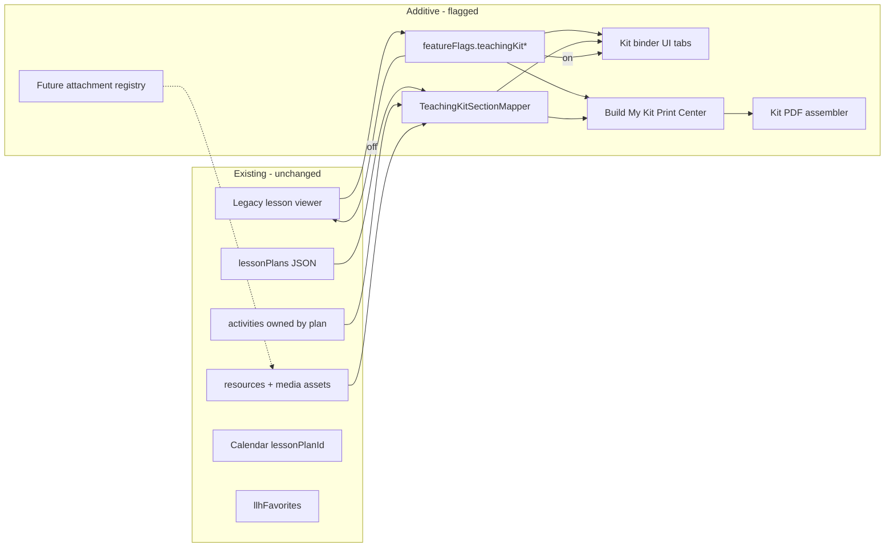

# Complete Teaching Kits — Phase 1 Architecture (No Migration)

**Status:** Architecture approved · **Slice 1A–1E done** · flags still off · **stop for 1E review**  
**Branch:** `cursor/teaching-kit-architecture-9ad1`  
**Date:** 2026-08-03  
**Base:** `origin/main` @ `f36c0c272367c6000fd310dac62b9a0938903ca4`  
**Related:** Phase 0 read-only audit (chat); existing curriculum in `siteContent.curriculum`; product design v4 approved

---

## 0. Locked requirements (owner-approved)

These rules are binding for every Teaching Kit implementation slice:

1. **Entitlements are non-bypassable.** Build My Kit / Print Center must never bypass existing Free, Trial, Pro, Founding, admin, or role permissions. Premium kit PDF generation must call the **existing server-enforced trial export authorization, watermark, and remaining-export counting path** (`scripts/trial-curriculum-exports.js` + server handlers) **before** any client PDF assembly begins.
2. **One canonical section/category config.** Teaching Kit sections and activity-category mappings live in a single shared module (`scripts/teaching-kit.js`). Do not maintain independent server and client maps that can drift. If dual execution environments cannot share one runtime, add **parity tests** that compare both sides.
3. **Flags default false and are normalized server-side.** `teachingKitViewer`, `teachingKitPrintCenter`, and `teachingKitAttachments` default to `false`. Only an explicit `true` enables a flag after normalization.
4. **No bulk rewrite.** Adding optional Teaching Kit fields must not bulk-rewrite or mutate existing lesson plans. Absence of `teachingKit` remains valid forever.
5. **Fail safe to legacy.** Unknown or malformed Teaching Kit data must normalize away (omit) so the legacy viewer remains the path of record.
6. **Slice scope lock.** Slice 1A adds flags + passthrough only. Do **not** add attachments UI, the new viewer, PDF generation, migration, or production flag enablement in 1A.

### Slice 1A (authorized)

| In scope | Out of scope |
| --- | --- |
| Flag keys + server normalization (default `false`) | Viewer / binder UI |
| Optional `teachingKit` passthrough on lesson plans | Print Center / Build My Kit PDF |
| Canonical section config module (no consumer UI yet) | Attachments upload/admin UX |
| Focused tests + regression suites | Migration / bulk enrichment |
| Docs updates | Enabling flags in production |

---

## 1. Purpose

Upgrade the *experience* of every lesson plan into a **complete printable teaching kit** without rebuilding or migrating the current curriculum architecture.

Providers should open any existing lesson plan and:

1. View kit sections when content exists (and never see empty sections as a regular user).
2. Use **Print Teaching Kit** → **Build My Kit** to select exactly which sections to include.
3. Generate **one clean PDF** with only the selected sections.

All of this must be **additive**, **feature-flagged**, and **non-breaking**.

---

## 2. Non-negotiable constraints

| Constraint | Rule |
| --- | --- |
| Existing lesson plans | Continue to open, display, assign, favorite, print (legacy), and appear in calendar |
| Existing APIs | `/api/site-content`, `/api/curriculum/lesson-plans/:id`, activities, schedule assign — unchanged contracts |
| Calendar / favorites | `lessonPlanId` stability; `llhFavorites` unchanged |
| Permissions / subscriptions | Free / Trial / Pro / Founding / Center roles / Admin unchanged; server-enforced |
| Migration | **None** in this phase — no bulk rewrite of plans or activities |
| Marketplace printables | Do **not** revive `PRINTABLES_FEATURE_REMOVED` marketplace; kit printables attach to lessons/resources |
| Stripe / auth / pricing | Untouched |
| Deploy / merge | Not until explicit approval |

---

## 3. Design principles

1. **Additive overlay, not replacement.** Teaching Kit reads existing plan fields first; optional kit metadata layers on later.
2. **Legacy renderer stays default.** New binder UI and Print Center appear only when flags are on.
3. **Empty sections hidden** for providers; admins may preview empties.
4. **Build My Kit is the differentiator.** One PDF, selected sections only — not a forced full packet.
5. **Future-ready attachments.** Printable resource types are an enum + join list, not hardcoded lesson fields.
6. **No silent cross-plan mutation.** When reusable masters arrive later, plans pin published revisions (Phase 0 recommendation). Phase 1 does not introduce live shared masters.
7. **Performance budgets.** Do not ship full kit + binaries in `/api/site-content`. Detail + on-demand print assembly only.

---

## 4. Current system (baseline — confirmed)

Curriculum lives in JSON: `store.siteContent.curriculum`:

```
{ lessonPlans[], activities[], resources[], series[], updatedAt }
```

Canonical normalizers in `server/index.js`:

- `normalizedCurriculumLessonPlan`
- `normalizedCurriculumDailyPlanDay` / items
- `normalizedCurriculumActivity` (**requires** `lessonPlanId`)
- `normalizedCurriculumResource`

Already present on plans (map to kit sections):

| Kit need | Existing field(s) |
| --- | --- |
| Weekly overview | `weeklyOverview` |
| Objectives | `objectives` |
| Vocabulary | `vocabularyWords` |
| Materials | `weeklyMaterials` + day `materials` |
| Mon–Fri | `dailyPlans.monday…friday` |
| Circle / outdoor / etc. | Day fields + `items[].activityCategory` |
| Books / songs | `books[]`, `songs[]` (+ day-level) |
| Teacher tips / adaptations | `adaptations`, day notes |
| Observation | `observationOpportunities`, day `observations` |
| Family | `familyConnection` |
| Extensions | Activity `extensions` |
| Printable resources | `resourceIds` → `curriculum.resources[]` |
| Covers | `coverImageUrl` (+ `llh_media_assets`) |

**Gap vs complete kit:** no first-class example photos gallery, no structured Print Center, no section picker PDF, no vocabulary-card / family-letter / observation-form generators, no future attachment taxonomy beyond `resourceCategory`.

---

## 5. Target architecture (additive)



### 5.1 Feature flags

Extend `siteContent.featureFlags` (canonical defaults in `scripts/teaching-kit.js` + `normalizedFeatureFlags` in `server/index.js`):

| Flag | Default | Purpose |
| --- | --- | --- |
| `teachingKitViewer` | `false` | Binder tabs / sections over legacy viewer |
| `teachingKitPrintCenter` | `false` | Print Teaching Kit + Build My Kit |
| `teachingKitAttachments` | `false` | Admin attach typed printables/examples (future-ready hooks) |
| `teachingKitQualityDashboard` | `false` | Later phase — not Slice 1A |

Normalization rule: each Teaching Kit flag is `true` only when the stored value is strictly `=== true`; otherwise `false`.

**Rollout:** Admin → QA allowlist → selected accounts → production (explicit approval).  
Server must ignore new routes/behaviors when flags are off. **Do not enable in production in Slice 1A.**

Optional account allowlist (later): `siteContent.teachingKitAllowlist.emails[]` — design hook only until a later slice.

### 5.1.1 Build My Kit entitlement gate (mandatory)

Before generating any premium Teaching Kit PDF:

1. Resolve the user via existing curriculum access (`resolveCurriculumAccessUser` / membership helpers).
2. If the export is Trial-premium-gated, run the **existing** trial export authorize → watermark → decrement/remaining path.
3. Only after that succeeds may the client assemble the selected-section PDF.
4. Free users remain limited to unlocked starter plans; Pro/Founding/admin follow existing unlock rules.
5. Staff/directors continue to inherit the program owner’s curriculum entitlement.

UI hiding is never sufficient authorization.

### 5.2 Compatibility marker (non-migrating)

Add **optional** fields on lesson plans when first touched by kit tooling (not bulk-written):

```js
{
  // existing fields unchanged…
  teachingKit: {
    schemaVersion: 1,          // kit overlay version
    completeness: "legacy_mapped", // legacy_mapped | enriched | complete
    sectionOverrides: {},      // optional display-only tweaks
    attachmentIds: [],         // ids into curriculum.resources or future kitAttachments
    exampleImageIds: [],       // media asset ids
    updatedAt: ""
  }
}
```

- Absence of `teachingKit` ⇒ mapper uses **legacy field mapping only** (every current plan works).
- No requirement to set this on existing plans.
- Normalizer must **pass-through unknown-safe** optional object; never strip existing plan body.

### 5.3 Section mapper (read model)

Pure function (new module, e.g. `server/teaching-kit/map-lesson-to-kit.js` + mirrored client helpers):

`mapLessonPlanToTeachingKit(plan, activities, resources, options) → TeachingKitViewModel`

Rules:

- Source of truth remains the existing plan/activities/resources.
- Sections with no content → omitted for providers (`visible: false`).
- Activity categories map into kit buckets (Circle Time, Sensory, STEM, …) via existing `activityCategory` + day fields.
- Does **not** rewrite storage.

Suggested section IDs (stable for Print Center checkboxes):

| `sectionId` | Label | Primary sources |
| --- | --- | --- |
| `overview` | Weekly Lesson Overview | `weeklyOverview`, theme, age, duration meta |
| `objectives` | Learning Objectives | `objectives`, domains |
| `vocabulary` | Vocabulary Words | `vocabularyWords` |
| `materials` | Materials List | `weeklyMaterials`, day materials, item materials |
| `weekly_plan` | Monday–Friday Lesson Plans | `dailyPlans` summary |
| `daily_activities` | Daily Activities | day `items[]` |
| `circle_time` | Circle Time | day `circleTime` + category filter |
| `books` | Books | `books` + day books |
| `songs` | Songs | `songs` + day songs |
| `process_art` | Process Art | category filter |
| `invitations` | Invitations to Play | category filter |
| `small_group` | Small Group | category filter |
| `large_group` | Large Group | category filter |
| `outdoor` | Outdoor Activities | `outdoorPlay` + category |
| `fine_motor` | Fine Motor | category |
| `gross_motor` | Gross Motor | category |
| `sensory` | Sensory | category |
| `stem` | STEM | category |
| `dramatic_play` | Dramatic Play | category |
| `teacher_tips` | Teacher Tips | `adaptations`, safety, teacher language |
| `observations` | Observation Prompts | observation fields |
| `family` | Family Connection | `familyConnection` |
| `extensions` | Extension Activities | activity `extensions` |
| `printables` | Printable Resources | linked resources |
| `examples` | Activity Picture Examples | example image ids / future |
| `teacher_notes` | Teacher Notes | plan/day notes |
| `vocab_cards` | Vocabulary Cards | derived print layout from vocabulary |
| `family_letter` | Family Letter | derived from family + overview |
| `observation_forms` | Observation Forms | derived printable layout |

Category mapping table lives in one config file so admin can extend types later without schema churn.

### 5.4 Build My Kit (Print Center)

**UX name:** Print Teaching Kit → opens **Build My Kit**.

Provider flow:

1. Tap **Print Teaching Kit**.
2. See checklist (presets: Full Kit / Weekly Only / Classroom Essentials).
3. Toggle sections; disabled toggles for empty sections (with “not available for this plan”).
4. Options: include cover, images on/off, ink-saver (B&W), teacher notes on/off.
5. **Generate PDF** → one document, selected sections only, US Letter, page numbers, lesson title in header/footer.

**Entitlements (reuse existing):**

- Free: starters only; no Pro body leak.
- Trial: existing export caps + watermark path (`trial-curriculum-exports.js`) — kit PDF **must not bypass**.
- Pro / Founding / Admin: full kit print for unlocked plans.

**Generation strategy (recommended):**

| Option | Pros | Cons |
| --- | --- | --- |
| A. Client print stylesheet + `window.print()` | Fast, low server memory | Harder multi-section PDF fidelity |
| B. Client-assembled PDF (existing DOCX/PDF helpers) | Fits current patterns | Bundle size; consistency |
| C. Server PDF | Consistent | Memory risk on Render (see `docs/RENDER_OOM_MEMORY.md`) |

**Phase recommendation:** **B with print-preview HTML**, streaming/sectioned assembly; avoid holding multi-plan PDFs in server memory. Trial watermark continues server-side where already required.

Do **not** auto-generate a PDF when a lesson opens.

### 5.5 Future-ready attachments (no architecture change later)

Introduce a **typed attachment registry** concept (flagged; can start empty):

```js
// Stored as curriculum.resources entries OR later kitAttachments[]
{
  id: "cur-res-…",
  title: "Ocean Vocabulary Cards",
  resourceCategory: "Vocabulary Cards", // extend enum
  attachmentType: "flashcards",         // new optional field
  lessonPlanIds: ["cur-lp-…"],
  activityIds: [],                      // optional future
  access: "inherit",                    // inherit plan Free/Pro
  mediaAssetId: "…",
  pageCount: 2,
  paperSize: "letter",
  orientation: "portrait",
  colorMode: "color",
  status: "published"
}
```

Initial `attachmentType` enum (configurable list, not hardcoded UI only):

- `printable_pdf`, `flashcards`, `poster`, `name_tags`, `classroom_labels`, `matching_cards`, `coloring_page`, `cutting_practice`, `worksheet`, `visual_schedule`, `parent_handout`, `song_lyrics`, `teacher_instructions`, `observation_sheet`, `example_photo`

Existing `CURRICULUM_RESOURCE_CATEGORIES` can be extended carefully in a later implementation PR; Phase 1 only documents the enum.

---

## 6. Database / schema proposal

### 6.1 What we will **not** do in Phase 1

- No new Postgres tables required for MVP mapping.
- No migration scripts rewriting `lessonPlans`.
- No split of `llh_store` curriculum document (separate store-split project).

### 6.2 Schema changes (proposal only — implement in a later approved PR)

**A. Feature flags** in `siteContent.featureFlags` (already a JSON object).

**B. Optional `teachingKit` object** on lesson plan (pass-through in `normalizedCurriculumLessonPlan`).

**C. Optional fields on `normalizedCurriculumResource`:**

- `attachmentType`, `pageCount`, `paperSize`, `orientation`, `colorMode`, `printingInstructions`

**D. Media:** continue `llh_media_assets` for binaries; example photos as `kind: "activity_example"` (or similar).

**E. Future (Phase 2+) relational extract — not now:**

Only if JSON size / memory forces it: `teaching_kit_attachments` table. Design keeps IDs stable so extraction is possible without lesson redesign.

### 6.3 Integrity rules (when implemented)

- No cascading delete of resources referenced by plans.
- Archive ≠ remove from published kit resolution.
- Sort order on attachment links.
- Validate upload MIME/size (keep 5 MB resource / 2 MB cover caps unless approved).

### 6.4 Versioning (future phases; design now)

When reusable masters arrive:

- Plan links `{ resourceId, revisionId, overrides }`
- Publish creates immutable revision
- Autosave never publishes

Phase 1 Print Center does **not** depend on masters.

---

## 7. API proposal (additive, flagged)

| Endpoint | Method | Purpose |
| --- | --- | --- |
| Existing detail | `GET /api/curriculum/lesson-plans/:id` | Unchanged; may later include `teachingKit` passthrough |
| `GET /api/curriculum/lesson-plans/:id/teaching-kit` | GET | Mapped view model (sections + availability). 404/empty if flag off |
| `POST /api/curriculum/lesson-plans/:id/teaching-kit/print` | POST | Optional server assist for trial watermark; body = selected `sectionIds` + options |

List endpoint `/api/site-content` must **not** grow full kit payloads.

---

## 8. UI architecture

### 8.1 Entry points

- Lesson workspace header: primary **Print Teaching Kit** (flag on).
- Legacy print/PDF/DOCX remain until Print Center replaces them (flag transition).
- Mobile: **More** menu → Print Teaching Kit / Assign / Favorite.

### 8.2 Viewer (flag `teachingKitViewer`)

Desktop: cover + title row; tabs:

Overview · Weekly Plan · Activities · Printables · Songs · Books · Examples · Teacher Toolkit

Mobile: same sections via horizontal scroll tabs or select.

Empty sections omitted.

### 8.3 Build My Kit modal

See interactive mockups: [`docs/teaching-kit/mockups/interactive.html`](./teaching-kit/mockups/interactive.html)

Presets + checkboxes + generate CTA.

### 8.4 Accessibility

Keyboardable tabs/checkboxes, focus rings, alt text on examples, print layouts not color-only, 44px touch targets.

---

## 9. Authorization matrix (kit-specific)

| Action | Guest | Free | Trial | Pro/Founding | Staff* | Admin |
| --- | --- | --- | --- | --- | --- | --- |
| View kit sections (unlocked plan) | Preview only | Starters | Yes | Yes | Inherit owner | Yes |
| Build My Kit PDF | No Pro body | Starters | Cap + watermark | Yes | Inherit | Yes |
| Attach resources | No | No | No | No | No | Yes |
| Flag / dashboard | No | No | No | No | No | Yes |

\* Staff/directors inherit program owner curriculum entitlement (existing `resolveCurriculumAccessUser`).

---

## 10. Implementation plan (after approval)

Ordered, stop-for-review slices:

| Slice | Work | Exit criteria |
| --- | --- | --- |
| **1A** ✅ done | Flags + normalizer passthrough `teachingKit` + canonical `scripts/teaching-kit.js` | Flags default off; public `/api/site-content` omits `featureFlags`; no bulk rewrite; legacy tests green; no viewer/PDF |
| **1B** ✅ done | `mapLessonPlanToTeachingKit` + companion read-model + fixture tests | Maps Bugs & Butterflies + enriched/empty fixtures; empty sections omitted; flags still false; **no UI/API/PDF** |
| **1C** ✅ done | `GET /api/curriculum/lesson-plans/:id/teaching-kit` behind viewer/print flags | Flag off → 404; auth parity with detail; Pro/Trial/free-starter unlock; locked preview has no companion body; public site-content unchanged |
| **1D** ✅ done | Companion binder UI behind `teachingKitViewer` | Start/Setup/Today/Open Everything/Activity+Substitute/Build/Binder preview; back/favorite/assign intact; fail closed to legacy workspace; flags stay false |
| **1E** ✅ done | Build My Kit Print Center + client binder print path behind `teachingKitPrintCenter` | Presets + section toggles; professional cover/tabs/footers; selected activities only; trial authorize before print; legacy print still works; flags stay false |
| **1F** ✅ done (review) | Polish + edge cases + Trial/Pro print gate hardening | Empty/large kits safe & fast; Letter/A4; page-break/image scaling; loading + panel nav; authorize-before-build regressions; flags stay false |
| **1G** | AttachmentType enum + admin attach hook (optional) | Future types documented + one test resource |
| **1H** | QA checklist + controlled flag enable | Owner approval before wider release |

**Explicitly deferred:** reusable activity masters, song/book libraries, quality dashboard, legacy conversion tool, bulk enrichment, Family Hub.

---

## 11. Risks

| Rank | Risk | Mitigation |
| --- | --- | --- |
| Critical | Server-side large PDF OOM | Prefer client assembly; section caps; no open-on-load PDF |
| Critical | Entitlement bypass via new print route | Reuse `resolveCurriculumAccessUser` + trial module |
| High | `/api/site-content` payload growth | Kit data only on detail/kit endpoints |
| High | Duplicate activity text confusion in PDF | Dedupe by `sourceKey` / itemId in mapper |
| Medium | Category mapping misses custom labels | Configurable map + “Other activities” bucket |
| Medium | Flag on with incomplete UI | Flags independent; Print Center can ship after viewer |
| Medium | Conflict with removed printables marketplace | Kit attachments ≠ marketplace; keep `PRINTABLES_FEATURE_REMOVED` |
| Low | PWA stale shell | Cache-bump `service-worker.js` when shipping UI |

---

## 12. Testing plan (for implementation PRs)

Preserve all existing `test-curriculum*` / `test-lesson*` / calendar / access tests.

Add (when coding):

- Mapper fixtures (Infant/Toddler/Preschool sample)
- Flag-off ⇒ no new UI routes behavior
- Kit endpoint auth (guest/free/pro/trial)
- Build My Kit omits empty sections
- Trial watermark/remaining unchanged
- Favorite + assign regression (Playwright)

---

## 13. Rollback

1. Set flags to `false` in site content (no data migration to undo).
2. Optional `teachingKit` objects on plans are inert when flags off.
3. No deploy of this architecture PR to production without approval.

---

## 14. Deliverables in this PR

| Artifact | Path |
| --- | --- |
| Architecture + schema + plan + risks | `docs/TEACHING_KIT_PHASE1_ARCHITECTURE.md` |
| Mockup index | `docs/teaching-kit/README.md` |
| Interactive UI mockups (desktop/mobile/Build My Kit) | `docs/teaching-kit/mockups/interactive.html` |
| Screenshots | `docs/teaching-kit/mockups/screenshots/*.png` |
| Canonical Teaching Kit module (Slice 1A) | `scripts/teaching-kit.js` |
| Mapper (Slice 1B) | `scripts/teaching-kit-mapper.js` → `mapLessonPlanToTeachingKit` |
| Fixtures | `scripts/fixtures/teaching-kit/*.json` |
| Slice 1A tests | `scripts/test-teaching-kit-slice-1a.js` (`npm run test:teaching-kit-slice-1a`) |
| Slice 1B tests | `scripts/test-teaching-kit-slice-1b.js` (`npm run test:teaching-kit-slice-1b`) |
| Slice 1C API | `GET /api/curriculum/lesson-plans/:id/teaching-kit` in `server/index.js` |
| Slice 1C tests | `scripts/test-teaching-kit-slice-1c.js` (`npm run test:teaching-kit-slice-1c`) |
| Slice 1D viewer UI | `scripts/teaching-kit-viewer.js` + `app.js` enhance hook + `styles.css` |
| Slice 1D tests | `scripts/test-teaching-kit-slice-1d.js` (`npm run test:teaching-kit-slice-1d`) |
| Slice 1E Print Center | `scripts/teaching-kit-print.js` + Build/Print UI + `printTeachingKitBinder` in `app.js` |
| Slice 1E tests | `scripts/test-teaching-kit-slice-1e.js` (`npm run test:teaching-kit-slice-1e`) |
| Slice 1F polish + gate | Empty/large UX, Letter/A4, page-break/image CSS, `evaluatePrintAuthorization`, loading hint |
| Slice 1F tests | `scripts/test-teaching-kit-slice-1f.js` (`npm run test:teaching-kit-slice-1f`) |
| Flag + schema wiring | `server/index.js` (internal normalization + plan passthrough), `app.js` defaults |

**Public `/api/site-content`:** continues to **omit** `featureFlags` (flags normalized in admin/store only). Kit payloads are **not** added to site-content.

**Slice 1C API rules**

- Enabled only when `teachingKitViewer` **or** `teachingKitPrintCenter` is strictly `true`
- Flag off → `404` `{ code: "teaching_kit_disabled" }`
- Auth parity with lesson-plan detail: Pro/Trial/admin → full kit; curated Free starter → full kit; otherwise locked preview (no companion/section bodies)
- Optional query: `day`, `readyMaterials` (comma-separated)

**Slice 1D UI rules**

- Loads only when Teaching Kit API returns `featureFlags.teachingKitViewer === true`
- Fail closed to existing Week/Plan/Activities/Materials workspace on 404 / error / locked
- Surfaces: Start Week · Monday Setup · Today (+ Open Everything) · Activity detail + Substitute · Build My Kit (selection) · Binder preview
- Preserves back, favorite/save, and Use This Plan / assign chrome
- Print PDF generation remains deferred to Slice 1E

**Slice 1E Print Center rules**

- Gated by `teachingKitPrintCenter === true` (viewer UI may still load with viewer flag alone)
- Presets: Today pack · Monday Setup pack · Week binder · Family pack
- Section toggles + activity add/remove before print
- Output: professional binder HTML (cover, tab dividers, running brand/footer, US Letter) via `window.print()`
- **Must** call existing `confirmTrialCurriculumExport` before print; watermark embedded when counted
- Legacy lesson print/download paths remain available

**Slice 1E does not include:** production flag enablement, merge/deploy, attachments UX, migrations.

**Slice 1F polish + entitlement rules**

- Empty kits show a calm banner and safe empty copy; print still builds (cover / empty notice)
- Large kits: panel-only nav rerender; map/print build stay under test budgets
- Print: `tk-print-keep` + flex footers + CSS page counters; images `object-fit: contain` with max-height
- Paper: US Letter (default) and A4 via injected `@page` size tag
- Gate order: flag/payload checks → `confirmTrialCurriculumExport` → watermark → `buildBinderPrintHtml` → print
- Flag-off never calls trial authorize (no export consumption)

**Slice 1F does not include:** production flag enablement, merge/deploy, attachments UX, migrations.

---

## 15. Approval checklist

- [ ] Owner approves additive overlay approach (no curriculum rebuild)
- [ ] Owner approves Build My Kit as primary print UX
- [ ] Owner approves flag names / defaults off
- [ ] Owner chooses PDF strategy (recommend client assemble + trial server watermark)
- [ ] Owner confirms printables = lesson attachments only (not marketplace return)
- [ ] Explicit approval to start implementation slice **1A**
