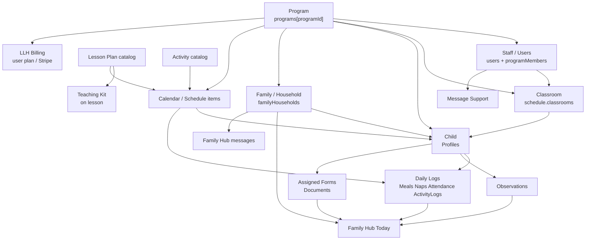

# Phase 4 — One Source of Truth (in progress)

**Status:** 🚧 In progress  
**Branch:** `cursor/phase4-one-source-of-truth-9c23`  
**Spine:** HDH / `main` testing architecture  
**Production:** Read-only — no writes, publishes, or merges  

Policy: `docs/audits/TESTING_IS_THE_FUTURE_POLICY.md`

---

## Goal

Eliminate duplicate or disconnected data models so every major object has **one authoritative source**, and every feature that references that object uses the same underlying data (not a separate copy).

Preserve existing data, relationships, IDs, and testing progress.  
Do **not** create duplicate records. Do **not** migrate production.

---

## Authoritative sources (declared)

| Object | Canonical source | Notes |
|---|---|---|
| **Program** | `store.programs[programId]` | Stable id from owner email |
| **Child** | `store.programData[programId].child.data.Profiles` | Synced via `/api/child-data`; LS is working cache |
| **Family / Guardian** | `store.familyHouseholds[id]` | Membership via `childIds`; live names from Profiles |
| **Staff** | `store.users` + `programMembers` / link fields | Role + `programId` / `linkedProgramOwnerEmail` |
| **Classroom** | `store.programData[programId].schedule.classrooms` | Child `classroomId` must match |
| **Lesson Plan** | `store.siteContent.curriculum.lessonPlans` | Catalog; assignments live on schedule items |
| **Teaching Kit** | Embedded on lesson plan | Not a separate collection |
| **Activity (catalog)** | `siteContent.curriculum.activities` | Distinct from care ActivityLogs |
| **Daily Log** | Same child blob (`Meals`, `Naps`, `Attendance`, `ActivityLogs`, …) | One program child document |
| **Observation** | Child blob `Observations` | CMS observation packs are templates only |
| **Forms (assigned)** | Child blob `Documents` | CMS `siteContent.forms` = library templates |
| **Billing** | `store.users` Stripe/plan fields | LLH membership — not tuition yet |
| **Messages** | Support `store.messages` **or** FH `familyHubMessages` **or** care `Communications` | Three channels — do not merge blindly; label clearly |
| **Calendar** | `store.programData[programId].schedule` | Prefer over legacy `scheduleByUser` / Weekly Planner dual-write |

---

## Relationship diagram

### How Family Hub connects

- Households hold **membership** (`childIds`) and guardian contact info.  
- Child identity, classroom, daily logs, observations, and assigned forms come from the **program child blob** (`Profiles` + care collections).  
- Family Hub Today / calendar / documents **overlay** live child data — they do not own a second child roster.  
- Parent messaging uses `familyHubMessages` (separate from Leah Message Support).

---

## Known duplicates / drift (work list)

1. Child: LS ↔ `programData.child` ↔ legacy `childData[uid]` ↔ household `children` snapshots  
2. Classroom: schedule rooms ↔ Profile.classroomId ↔ staff.classroomIds  
3. Staff: programMembers ↔ users ↔ client `llhAccounts` ↔ tester invites  
4. Forms: CMS library ↔ Documents ↔ local formTemplates  
5. Messages: three channels (support / FH / care Communications)  
6. Schedule vs Weekly Planner browser-global  

---

## Delivered so far

- Canonical read adapters: `server/canonical-data.js`  
- Drift reporter: `reportCanonicalDrift` + Owner Admin dry-run `GET /api/admin/testing/canonical-drift?programId=`  
- Owner Admin program detail reads via `buildCanonicalProgramBundle`  
- Family Hub: `childIds` + Profiles preferred; invite/update resolve names from Profiles; unlink respects `childIds`  
- `overlayLiveChildren` accepts authoritative `childIds`  
- Tests: `npm run test:canonical-data-phase4`  
- This diagram + source declaration  
- Final nav review closed before this phase: `PHASE3_FINAL_NAVIGATION_REVIEW.md`

## Next inside Phase 4 (not done yet)

- Wire more read paths (classroom roster, staff lists) through adapters  
- Dry-run drift on live testing stores (ops)  
- Continue stopping new household roster copies when Profiles already exist  
- Dual-read Weekly Planner → schedule (no delete yet)  
- Phase 4 completion report when remaining drift work is stable  

---

## Production confirmation

- [x] No production code deploy  
- [x] No production DB / curriculum / kit writes  
- [x] Testing-only work  
- [x] No production data migration  

---

## Related

- Final nav review before this phase: `docs/audits/PHASE3_FINAL_NAVIGATION_REVIEW.md`  
- Shared ownership: `docs/audits/SHARED_PROGRAM_OWNERSHIP_REPORT.md`
