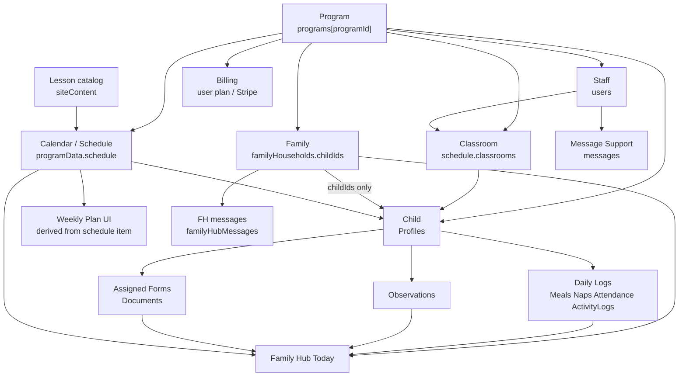

# Phase 4 — One Source of Truth

**Status:** ✅ Complete  
**Branch:** `cursor/phase4-one-source-of-truth-9c23`  
**Spine:** HDH / `main` testing architecture  
**Production:** Read-only — no writes, publishes, or merges  
**Completion report:** `docs/audits/PHASE4_ONE_SOURCE_OF_TRUTH_COMPLETION_REPORT.md`

Policy: `docs/audits/TESTING_IS_THE_FUTURE_POLICY.md`

---

## Finish line (plain language)

| Object | Where it lives |
|---|---|
| **Program** | `store.programs[programId]` |
| **Child** | `store.programData[programId].child.data.Profiles` |
| **Family** | `store.familyHouseholds[id]` — membership = `childIds`; names from Profiles |
| **Staff** | `store.users` (programId / linkedProgramOwnerEmail) |
| **Classroom** | `store.programData[programId].schedule.classrooms` |
| **Lesson catalog** | `store.siteContent.curriculum.lessonPlans` |
| **Lesson assignment** | `schedule.items` type `lesson_plan` |
| **Weekly Plan** | Derived from schedule lesson snapshot (`llhWeeklyPlanner` = temporary fallback) |
| **Daily logs / Observations / assigned Forms** | Same child blob |
| **Billing** | `store.users` Stripe/plan fields |
| **Message Support** | `store.messages` |
| **Family Hub messages** | `store.familyHubMessages` |
| **Care notes** | child blob `Communications` |

Every feature that needs a child, family, or staff row must read that same record.  
`server/canonical-data.js` is a thin read/drift helper over those homes — **not** another database.

---

## Relationship diagram (final implementation)

---

## Temporary migration layers (not permanent architecture)

| Layer | Role | Removal criteria |
|---|---|---|
| `llhWeeklyPlanner` | Dual-read fallback when no schedule item | Weeks on schedule; Calendar ≡ Weekly Plan without LS |
| `scheduleByUser` / `childData` UID mirrors | Write mirror + read fallback (`CANONICAL_MIRROR_LEGACY`) | Drift clean; mirror off on testing; no UID readers |
| Client `llhChild:*` / `llhScheduleItems:*` | Working caches | Always caches — durable truth stays programData |
| `programMembers` | Membership **index** derived from users | Keep as index; users remain authoritative |

See also: `docs/SCHEDULE_FOUNDATION.md`

---

## Drift

- `GET /api/admin/testing/canonical-drift?programId=` — read-only  
- Reports duplicate / orphan / mismatched / stale relationships  
- Suggests safe fixes; **does not auto-delete or rewrite**  
- Tests: `npm run test:canonical-data-phase4`, `npm run test:canonical-fixtures-phase4`

---

## Production confirmation

- [x] No production deploy  
- [x] No production DB / curriculum / kit writes  
- [x] No production migration  
- [x] Testing-only work  

---

## Related

- Completion report: `PHASE4_ONE_SOURCE_OF_TRUTH_COMPLETION_REPORT.md`  
- Final nav review (Phase 3): `PHASE3_FINAL_NAVIGATION_REVIEW.md`
