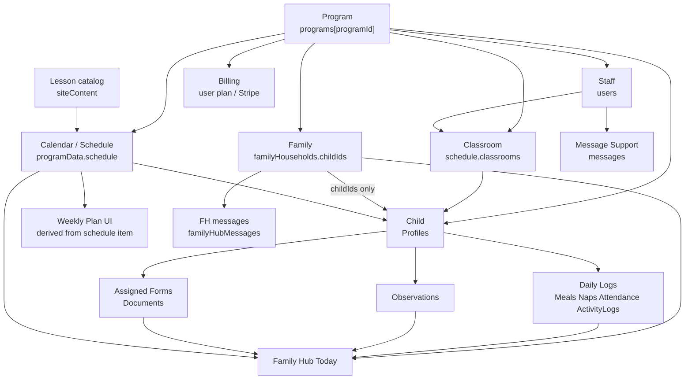

# Phase 4 — One Source of Truth Completion Report

**Phase:** 4 — One Source of Truth  
**Branch / PR:** `cursor/phase4-one-source-of-truth-9c23`  
**Spine:** HDH / `main` testing architecture  
**Date:** 2026-08-08  
**Owner:** Leah  
**Production modified?** **No**  
**Status:** ✅ **COMPLETE**

---

## 1. What was completed

- Declared and enforced one durable home per major object (see table + diagram below)  
- Removed second Family Hub name roster — membership is `childIds`; names from live Profiles  
- Families page shows Family Hub households as canonical; profile parentInfo is contact editing only  
- Weekly Planner dual-reads from schedule (authoritative); `llhWeeklyPlanner` is temporary fallback only  
- Enrollment classrooms read schedule only (no `programSettings.classrooms` fallback)  
- Expanded read-only drift reporting (households, classrooms, lessons, staff index, daily-log orphans, legacy mirrors)  
- Owner Admin program detail + `GET /api/admin/testing/canonical-drift` return sources + safe-fix suggestions (no auto-delete)  
- Admin user detail reads Profiles + program schedule (not wrong `programData.children` / email-keyed scheduleByUser)  
- Home Daycare + Center fixture tests with clean drift and intentional dirty-report checks  
- Documented temporary mirrors and removal criteria (`docs/SCHEDULE_FOUNDATION.md`, Phase 4 doc)  
- Plain-language homes map: `describeCanonicalHomes()`  

---

## 2. Canonical homes (finish line)

| Object | Where it lives |
|---|---|
| Program | `store.programs[programId]` |
| Child | `store.programData[programId].child.data.Profiles` |
| Family / Guardian | `store.familyHouseholds[id]` (`childIds`) |
| Staff | `store.users` (by program / linked owner) |
| Classroom | `store.programData[programId].schedule.classrooms` |
| Lesson Plan (catalog) | `store.siteContent.curriculum.lessonPlans` |
| Lesson assignment | `schedule.items` (`type=lesson_plan`) |
| Weekly Plan | **Derived from** schedule lesson snapshot |
| Daily Logs / Observations / assigned Forms | Same child blob |
| Family Hub | Households + live child blob overlay |
| Billing | `store.users` Stripe/plan fields |
| Messages | Three labeled channels (support / FH / Communications) |

**Adapters are thin reads of those homes — not a second database.**

---

## 3. Relationship diagram (final implementation)

---

## 4. Weekly Planner → schedule (temporary dual-read)

| | |
|---|---|
| **Authoritative** | `programData[programId].schedule` lesson item snapshot |
| **Temporary fallback** | `localStorage llhWeeklyPlanner` when no schedule item for the week |
| **Temporary server mirror** | `scheduleByUser[uid]` via `shouldMirrorLegacy()` / `CANONICAL_MIRROR_LEGACY` |
| **Remove fallback when** | All weeks on schedule; migrate flags set; Calendar ≡ Weekly Plan without LS planner |
| **Remove UID mirror when** | Drift clean on testing; `CANONICAL_MIRROR_LEGACY=0`; no readers depend on UID buckets |

---

## 5. Drift (report-first, non-destructive)

- Endpoint: `GET /api/admin/testing/canonical-drift?programId=` (admin + testing fence)  
- Reports orphans / mismatches / stale snapshots / legacy mirrors  
- Returns `safeFixesSuggested` — **does not delete or rewrite**  
- Fixture proof: dirty IDs remain in store after report  

---

## 6. Tests run and results

| Test | Result |
|---|---|
| `npm run test:canonical-data-phase4` | ✅ Passed |
| `npm run test:canonical-fixtures-phase4` | ✅ Passed (HD + Center) |
| `npm run test:owner-testing-admin-phase2` | ✅ 25/25 |
| `npm run test:shared-program-ownership` | ✅ Passed |
| `npm run test:schedule-foundation` | ✅ Passed |
| `npm run test:nav-role-experience` | ✅ Passed |
| `node --check` on touched server/app files | ✅ Passed |

---

## 7. Remaining known issues (non-blocking)

| Issue | Notes |
|---|---|
| Legacy UID mirrors still written by default | Controlled by `CANONICAL_MIRROR_LEGACY`; removal criteria documented |
| Client LS child/schedule caches | Working caches — durable truth remains programData |
| Forms template libraries (CMS / HDH pack / formTemplates) | Assigned forms = Documents; template consolidation deferred |
| Three message channels | Intentional; labeled, not merged |

---

## 8. Production not modified (required)

- [x] No production code deploy  
- [x] No production DB / curriculum / kit writes  
- [x] No production data migration  
- [x] No automatic delete of drift rows  
- [x] Testing-only Owner Admin / Family Hub fences preserved  

**Statement:** Production remained untouched during this phase.  
**Exceptions:** none  

---

## 9. Files changed (high level)

| Path | Summary |
|---|---|
| `server/canonical-data.js` | Homes, drift, schedule/lesson/billing/messaging inventory |
| `server/program-ownership.js` | `shouldMirrorLegacy` + documented temporary mirrors |
| `server/index.js` | Thin FH children; admin detail Profiles/schedule |
| `server/family-hub-lib.js` | `overlayLiveChildren` + childIds |
| `server/owner-testing-admin.js` | Canonical program bundle + drift homes |
| `app.js` | Planner dual-read; Families canonical; enrollment rooms |
| `docs/SCHEDULE_FOUNDATION.md` | Authoritative schedule + removal criteria |
| `docs/audits/PHASE4_ONE_SOURCE_OF_TRUTH.md` | Final sources + diagram |
| `scripts/test-canonical-*-phase4.js` | Unit + HD/Center fixtures |

---

## 10. Next phase

**Phase 5 — Daily Operations** may start after this report.  
Master tracker updated: `docs/audits/MASTER_PROJECT_PROGRESS.md`

---

## Sign-off

| Role | Name | Date |
|---|---|---|
| Agent / implementer | Cursor agent | 2026-08-08 |
| Owner | Leah | Phase 4 completion criteria requested; implementation ready for review |
