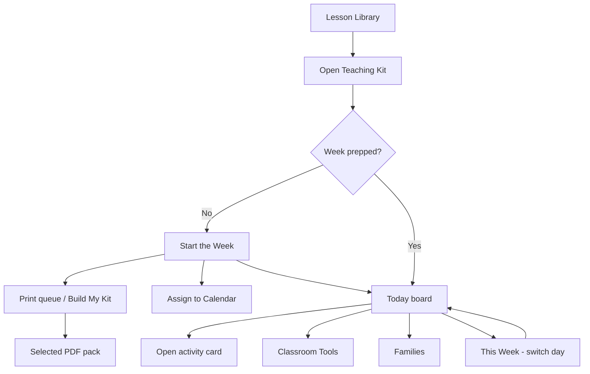

# Gold Standard Teaching Kit — Product Specification (Operations Redesign)

**Status:** Product design for review — **not approved · not implementation**  
**PR:** #436 (draft) · Slice 1A approved · Slice 1B **not started**  
**Example week:** *Bugs & Butterflies* · Toddler · Pro  
**Date:** 2026-08-03 (revised: classroom-operations framing)  

**Companion mockup:** [`mockups/gold-standard.html`](./mockups/gold-standard.html)

---

## 0. Why this redesign

The first draft still felt like a **lesson plan viewer with nicer tabs**.

Providers do not wake up Monday asking “which curriculum section should I browse?”  
They ask:

- What do I need ready before kids arrive?  
- What am I doing **today**?  
- What fits in the next 15 minutes?  
- What do I hand families?  
- What do I actually bother printing?

**New north star:** The Teaching Kit is the one place a provider opens Monday morning to **run their classroom for the week**.

---

## 1. Product promise

Little Learner Hub Teaching Kit = a **digital classroom binder for this week**.

It turns one weekly curriculum plan into an operational guide:

| Provider need | Kit answer |
| --- | --- |
| Save the most time | **Start the Week** prep checklist + print queue |
| Keep open all day | **Today** (living day board) |
| Print for real | Short day sheet, materials, vocab cards, family letter — via **Build My Kit** |
| Dig deeper only when stuck | Activity cards / resources drawer |
| Still find the curriculum story | Week glance + linked lesson plan metadata |

The **lesson plan** remains the curriculum source in the library.  
The **Teaching Kit** is how you *teach from it*.

---

## 2. Teaching Kit vs lesson plan

| | Lesson plan (library) | Teaching Kit (operations) |
| --- | --- | --- |
| Primary job | Catalog & curriculum content | Run this week’s classroom |
| Provider mindset | “What is this unit about?” | “What do I do before/during/after care today?” |
| Default screen | Browse card / overview | **Today** (or Start the Week if not prepped) |
| Organization | Content types (songs, books…) | Time & tasks (prep → today → week → tools) |
| Printing | Full plan dumps (legacy) | Selective **Build My Kit** packs |
| Open all day? | Rarely | **Yes — Today** |

Curriculum fields (objectives, Mon–Fri items, songs, books) still power the kit.  
The **UI hierarchy** changes so operations come first.

---

## 3. What saves the most time

Ranked for home daycare / small classroom providers:

1. **Know today in 10 seconds** — circle, activities, outdoor, observation focus  
2. **Materials already listed for the week + today** — shop/prep once  
3. **Print queue** — one tap packs (Today sheet, Vocab cards, Family letter)  
4. **Activity “how” only when needed** — not forced before circle time  
5. **Family piece ready Friday morning** — not hunted at pickup  

Design consequence: put **Start the Week** and **Today** above content browsing.

---

## 4. What they actually print

Research-of-practice assumption (validate with owner):

| Often printed | Sometimes | Rarely as a full packet |
| --- | --- | --- |
| Today’s run sheet (1–2 pages) | One activity instructions | Entire binder every week |
| Weekly materials list | Observation quick form | Every example photo |
| Vocabulary cards | Song lyric sheet (when allowed) | Full multi-day dump by default |
| Family letter | Book discussion guide | — |

**Build My Kit presets (operations-first):**

1. **Today’s classroom pack** (default) — today sheet + materials for today + observation focus  
2. **Week prep pack** — materials week list + Mon overview + vocab cards  
3. **Family pack** — family letter + home extension  
4. **Full Teaching Kit** — everything available (explicit, not default)

---

## 5. What stays open all day

**Today** is the all-day surface:

- Big “Today is Monday” context  
- Time-ordered blocks: Arrive / Circle / Invitation / Outdoor / Small group / Closing  
- One-tap open of the active activity  
- Sticky observation prompt  
- Mini materials for today only  
- “Jump to Tomorrow” at end of day  

Phone in apron pocket / tablet on counter: **Today**, not Overview.

---

## 6. Information architecture (redesigned)

Binder navigation (desktop left rail or top pills; mobile bottom or scroll pills):

| Nav item | Job | When used |
| --- | --- | --- |
| **Start the Week** | Prep checklist, shopping/materials, print queue, assign week to calendar | Sunday night / Monday before open |
| **Today** | Run the room right now | All day (default once week started) |
| **This Week** | Mon–Fri at a glance; pick another day into Today | Planning / mid-week shifts |
| **Activity Cards** | Deep instructions, adaptations, examples | Prep or when stuck mid-activity |
| **Classroom Tools** | Songs · Books · Printables · Pictures (grouped tools) | As needed during week |
| **Families** | Letters, home connections, pickup talking points | End of day / Friday |
| **Build My Kit** | Print / PDF center | Prep or as needed |

Secondary (chrome, not primary binder tabs):

- Back to library  
- Favorite  
- Linked lesson plan title / Pro badge / age (metadata, not the organizing principle)  
- Assign to Calendar (also in Start the Week)

---

## 7. End-to-end journey (operations)

### Monday-morning story

1. Opens Teaching Kit for the assigned week (*Bugs & Butterflies*).  
2. Lands on **Start the Week** first visit → checks materials, prints Today pack + vocab cards, assigns calendar if needed.  
3. Taps **Begin Today** → **Today** board stays open.  
4. Runs circle from Today; opens activity card only for the invitation setup.  
5. Uses observation prompt on Today during play.  
6. Friday: **Families** → send/print letter.  
7. Next week: new kit or same flow.

---

## 8. Screen specifications

### 8.1 Start the Week

**Purpose:** Collapse Sunday-night stress into one checklist.

Contains:

- Week title + age + theme (compact, not a marketing hero)  
- “Before children arrive” checklist (editable later; static in mockup)  
- Master materials (week) with “needed by Monday / Wednesday” hints  
- Print queue shortcuts: Today pack · Vocab cards · Family letter  
- Assign this week to Calendar  
- Setup picture strip (2–3 thumbs)  
- Primary CTA: **Begin Today**

### 8.2 Today (all-day board)

**Purpose:** The screen that stays open.

Contains:

- Today’s date label + day name  
- Day focus one-liner  
- Ordered schedule blocks (not curriculum taxonomy)  
- Each block: title, time estimate, “Open” if activity-linked  
- Today’s materials (short)  
- Observation focus (always visible)  
- Song for today (title + motions — lyrics on demand)  
- Book for today (title + one prompt)  
- Footer: Switch day · Build My Kit · Families  

### 8.3 This Week

**Purpose:** Glance + day switcher — not five dense columns.

- Mon–Fri cards with focus + 2 activity titles  
- Tap day → loads **Today** for that day  

### 8.4 Activity Cards

**Purpose:** Depth on demand.

- Same fields as before (setup, steps, adaptations, examples)  
- Entry from Today blocks or list  
- “Back to Today” always available  

### 8.5 Classroom Tools

**Purpose:** Supporting resources without making them the main IA.

Sub-areas (segments or nested pills): Songs · Books · Printables · Pictures  

Not top-level equal peers to “Today.”

### 8.6 Families

**Purpose:** Pickup and home connection.

- This week’s family letter  
- Talk-about-at-pickup bullets  
- Home extension ideas  
- Print / share actions  

### 8.7 Build My Kit

Operations-first presets (see §4).  
Still one PDF, selected sections only, entitlement-safe.

---

## 9. Desktop vs mobile

| | Desktop | Mobile / tablet |
| --- | --- | --- |
| Default | Today (or Start the Week if first open) | Today |
| Nav | Left binder rail | Bottom or horizontal pills + More |
| All-day use | Today full width | Today single column, large taps |
| Prep | Start the Week two-column checklist | Stacked checklist |
| Print | Build My Kit modal | Full-screen Build My Kit |

---

## 10. Example week content (still Bugs & Butterflies)

Content depth unchanged (complete week). **Presentation order** changes:

- Start the Week uses materials + printables + examples  
- Today Monday surfaces Leaf & Bug Sort + circle song + observation  
- Tools hold full song/book/printable libraries  
- Families hold the letter  

---

## 11. Explicit non-goals

- No runtime implementation  
- No Slice 1B  
- No merge/deploy/flag enablement  
- Not redesigning Lesson Library browse cards in this pass  
- Not building live editable checklists yet (show the UX pattern)

---

## 12. Owner review questions

Please react to these specifically:

1. Is **Today** the right all-day default?  
2. Is **Start the Week** the right first-run / Sunday surface?  
3. Do the print presets match what you would actually print?  
4. Does burying Songs/Books under **Classroom Tools** feel right — or do you want one of them promoted?  
5. Does this feel like a classroom binder rather than a lesson viewer?  
6. Anything missing for home daycare vs center lead teacher?

**Stop here until UX direction is approved.** Then we can align Slice 1B data work to *operations objects* (Today board, prep checklist, print packs) — not only content tabs.
