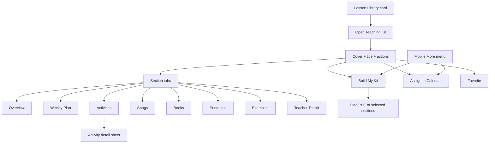

# Gold Standard Teaching Kit — Product Specification & UX Validation

**Status:** Product design for review — **not implementation**  
**PR:** #436 (draft) · Slice 1A approved · Slice 1B **not started**  
**Example lesson:** *Bugs & Butterflies* · Toddler · Pro · 1 week  
**Date:** 2026-08-03  

**Purpose:** Validate the complete childcare-provider experience for one finished Teaching Kit *before* building the underlying data model for Slice 1B+.

**Companion mockup:** [`mockups/gold-standard.html`](./mockups/gold-standard.html) (clickable, desktop + mobile + print)

---

## 1. Product promise

When a provider opens a complete Teaching Kit, they should feel they have opened a **digital teacher binder** for the week — not a thin lesson card that sends them to Pinterest.

They can:

1. Understand the week in under a minute (Overview).
2. Teach day by day with clear activities (Weekly Plan).
3. Dive into any activity with setup, steps, adaptations, and examples.
4. Use songs, books, vocabulary, and printables without leaving the kit.
5. Open **Build My Kit** and print **only** what they need as one clean PDF.

Empty sections never appear for regular users. Incomplete kits simply hide what is missing.

---

## 2. Example kit (gold standard content)

| Field | Value |
| --- | --- |
| Title | Bugs & Butterflies |
| Age | Toddler (18–36 months) |
| Duration | 1 week |
| Access | Pro |
| Theme | Insects & Gardens |
| Brand signal | “Little Learner Hub · Teaching Kit” in hero |

### Completeness bar this example must pass

- Clear weekly focus + objectives + vocabulary + master materials  
- Monday–Friday plan with readable day view  
- ≥2 songs, ≥2 books with discussion prompts  
- Detailed activity instructions + adaptations + observation + family  
- ≥1 printable set (vocabulary cards) + family letter  
- ≥1 setup / finished example image set  
- Teacher Toolkit checklist that **links** rather than duplicates  

---

## 3. End-to-end user journey

### Journey steps (provider story)

1. **Discover** — Finds *Bugs & Butterflies* in Lesson Library (cover, age, Pro badge).  
2. **Open** — Enters Teaching Kit. First view: cover atmosphere, title, age, duration, Pro, short description, primary actions.  
3. **Orient** — Overview: weekly focus, objectives, vocabulary chips, materials, family summary.  
4. **Plan the week** — Weekly Plan: Mon–Fri chips; one day readable; activity cards with View.  
5. **Prepare an activity** — Opens activity: setup, steps, teacher language, adaptations, example photo.  
6. **Gather extras** — Songs (motions), Books (questions), Printables (vocab cards), Examples gallery.  
7. **Toolkit check** — Teacher Toolkit: prep checklist + links into kit sections.  
8. **Print** — Build My Kit → choose sections → Generate PDF.  
9. **Assign** — Assign to Calendar (existing flow; unchanged).  
10. **Return** — Back to library; favorite persists.

---

## 4. Information architecture

### Desktop binder tabs (left-to-right)

| Tab | Job |
| --- | --- |
| Overview | Week at a glance |
| Weekly Plan | Day selector + daily content |
| Activities | All reusable activity cards for the kit |
| Songs | Song list + motions / lyrics when allowed |
| Books | Book guides + discussion questions |
| Printables | Attached printable resources |
| Examples | Setup / finished photos |
| Teacher Toolkit | Prep checklist + deep links |

Hidden when empty: Examples, Printables, etc. (admin preview may show empties later — not in this gold-standard demo).

### Mobile

- Compact header: Back · Title · Age · Badge · Favorite · More  
- Horizontally scrollable tabs (same sections)  
- More menu: Assign · Print Teaching Kit · Legacy print (secondary)  
- One activity card emphasis; day selector as chips  

---

## 5. Screen-by-screen specification

### 5.1 Desktop header

**Contains**

- Full-bleed cover atmosphere (materials / garden theme — no children required)  
- Brand line: Little Learner Hub · Teaching Kit  
- Title (hero)  
- Meta: age · duration · Free/Pro · theme  
- Short description (1–2 sentences)  
- Actions: Back · Favorite · Assign to Calendar · **Print Teaching Kit** (primary)  
- Secondary: More print (legacy) only until Print Center fully replaces it  

**Does not contain**

- Stats strips, schedule snippets, promo chips on the cover  
- More than one primary CTA  

### 5.2 Overview

**Blocks (structured lists, not walls of text)**

1. Weekly focus  
2. Learning objectives (bullets)  
3. Developmental domains (chips)  
4. Vocabulary (chips → link to Vocabulary Cards printable)  
5. Master materials  
6. Teacher preparation  
7. Safety / inclusion notes  
8. Family connection summary  

### 5.3 Weekly Plan

**Desktop**

- Week strip summary (optional one-line per day)  
- Mon–Fri selector  
- Selected day panel: focus, circle, book, song, activity cards, outdoor, observation, family note  

**Mobile**

- Day chips or dropdown  
- One day at a time  
- No five-column tiny grid  

**Activity card fields**

- Title · thumbnail · type · setup time · duration · main skills · View · Print instructions (if available)  

### 5.4 Activities

List of all kit activities (deduped). Opening one shows a **sheet / panel**:

- Short description  
- Materials + substitutions  
- Preparation / setup  
- Step-by-step  
- Teacher language / questions  
- Safety / allergy  
- Adaptations · simplified · extension  
- Observation prompts  
- Family extension  
- Related examples / printables  

### 5.5 Songs

For each song:

- Title  
- Type / when to use  
- Motions / actions  
- Learning focus  
- Lyrics **only** when original or verified public domain  
- Copyrighted modern songs: title + activity suggestion + motions — **no full lyrics**  
- Print Lyrics when a lyric sheet printable exists  

### 5.6 Books

- Title · author · short description  
- Vocabulary  
- Before / during / after questions  
- Extension activity  
- Note: Little Learner Hub does **not** provide the full book  

### 5.7 Printables

Cards with:

- Title · type · pages · color/B&W · preview thumb  
- View · Print · Download (respect subscription / trial rules)  

Gold-standard example attachments:

1. Bug Words vocabulary cards (6 cards)  
2. Family letter — This week outdoors  
3. Observation quick sheet (optional)  

### 5.8 Vocabulary

Shown in Overview as chips; printable pack under Printables; Toolkit links to both.

### 5.9 Examples

Gallery types:

- Materials layout  
- Setup example  
- Work-in-progress  
- Finished activity  
- Classroom invitation (no children / simple table setup)  

Style: flat educational / paper mockup / simple materials photo — not glossy AI children.

### 5.10 Teacher Toolkit

Single prep surface:

- Materials checklist (linked)  
- Preparation checklist  
- Printable list  
- Song list · Book list  
- Vocabulary cards link  
- Setup examples link  
- Safety · cleanup · observation · family  

Does **not** paste full activity text again.

### 5.11 Build My Kit (Print Center)

**Entry:** Print Teaching Kit button (header / mobile More).

**Presets**

- Full Teaching Kit  
- Weekly essentials  
- Classroom day pack  
- Family pack  

**Checkboxes** (unavailable if empty)

Full Kit · Weekly Lesson Plan · Daily Activities · Materials · Books · Songs · Vocabulary Cards · Family Letter · Observation Forms · Printable Resources · Activity Picture Examples · Teacher Notes  

**Options**

- Cover page · Include images · Ink saver (B&W) · Teacher notes  

**Output**

- One US Letter PDF, selected sections only  
- Lesson title + page numbers  
- Ink-conscious (no large colored backgrounds)  
- **Entitlement:** must use existing Free/Trial/Pro/Founding/admin rules; Trial premium exports use current server watermark + remaining count **before** client assembly  

---

## 6. Desktop vs mobile experience matrix

| Moment | Desktop | Mobile |
| --- | --- | --- |
| Open kit | Full-bleed cover + toolbar | Compact header + More |
| Navigate | Tab bar | Scroll tabs |
| Weekly plan | Day chips + wide panel | Day chips + stacked cards |
| Activity | Side or modal detail | Full-screen sheet |
| Print | Modal Build My Kit | Same modal, full width |
| Assign / Favorite | Toolbar buttons | Favorite icon + More |

---

## 7. Interaction & motion (intentional, minimal)

1. Tab / day change: short fade-rise (~250ms).  
2. Build My Kit modal: rise + dim backdrop.  
3. Favorite: brief scale pulse on toggle.  

No decorative animation noise.

---

## 8. Accessibility

- Keyboard tabs & checkboxes  
- Visible focus rings (design tokens)  
- Semantic headings  
- Alt text on example images  
- Tabs announce selected state  
- Touch targets ≥ 44px on mobile  
- Print does not rely on color alone  

---

## 9. What this validates for data model (later)

| UX need | Later model implication |
| --- | --- |
| Activity opens the same from Mon and Activities tab | Stable activity identity / link |
| Print Vocab Cards from Overview chip | Printable attachment IDs |
| Hide empty Examples tab | Section availability from content |
| Build My Kit section list | Canonical section IDs (`scripts/teaching-kit.js`) |
| Song without lyrics | Copyright classification field |
| Toolkit links | Computed summary, not duplicated blobs |

**This document does not define schema migrations.** It freezes the *experience* to design against.

---

## 10. Explicit non-goals (this deliverable)

- No runtime app/server implementation  
- No Slice 1B reusable-activity engineering  
- No merge / deploy / flag enablement  
- No admin editor redesign  
- No Family Hub  

---

## 11. Review checklist for owner

Please confirm or correct:

- [ ] Header actions (Back / Favorite / Assign / Print Teaching Kit) feel right  
- [ ] Tab set matches how you teach from a binder  
- [ ] Weekly Plan day-selector pattern (not 5-column grid)  
- [ ] Build My Kit presets and checkbox list  
- [ ] Gold-standard content depth for *Bugs & Butterflies* feels complete  
- [ ] Mobile More menu contents  
- [ ] Anything missing before Slice 1B data work  

**After review:** approve experience → then authorize Slice 1B (or request revisions).
