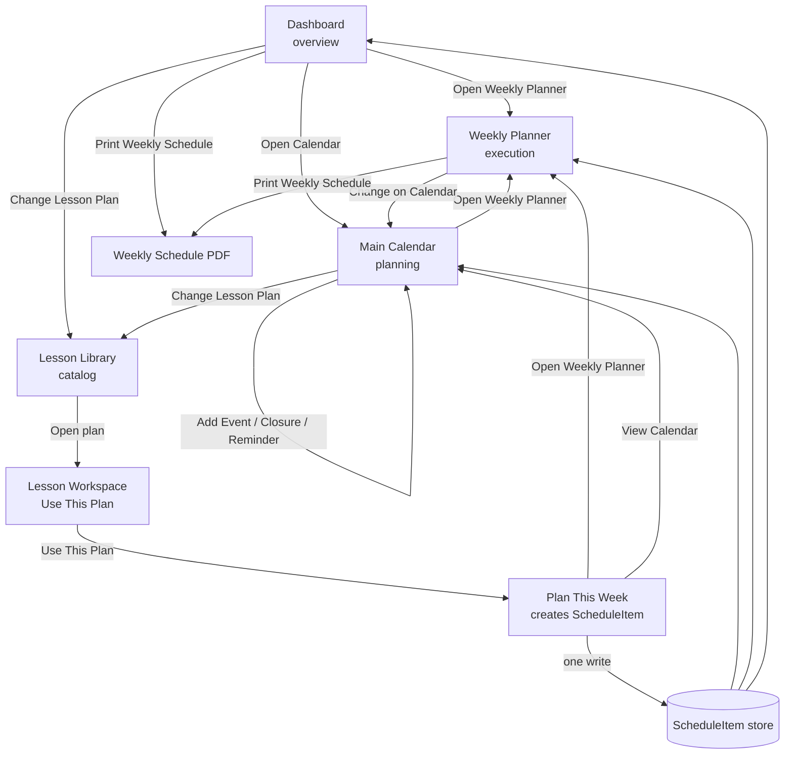
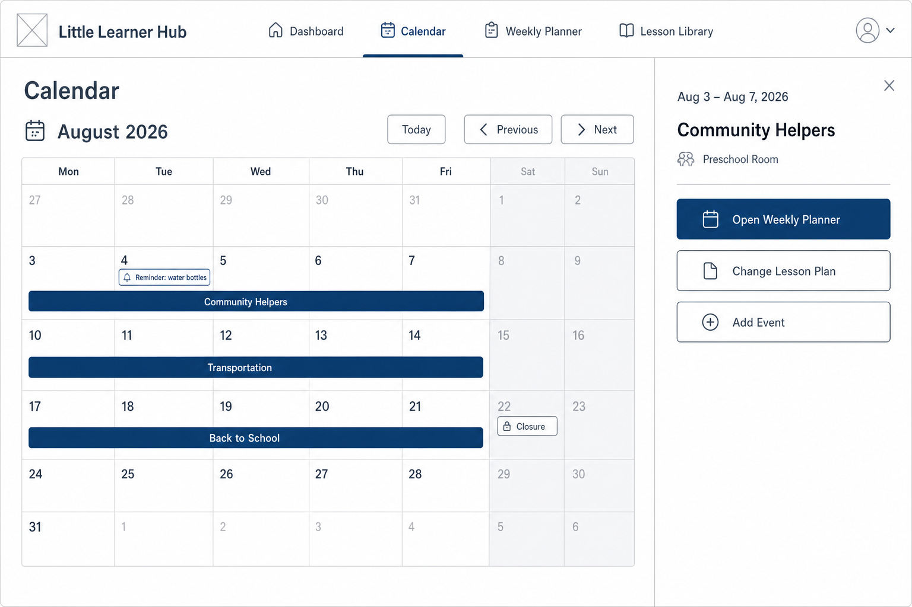
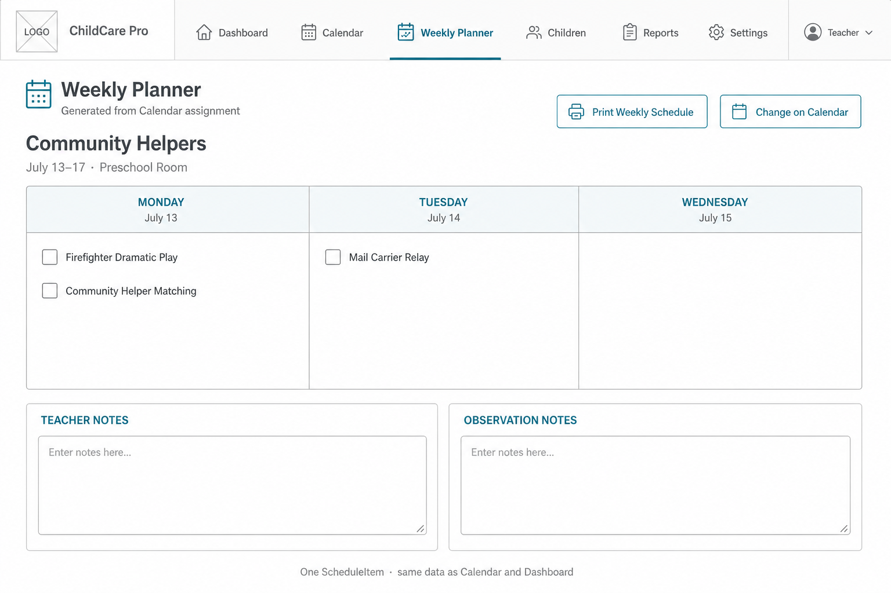
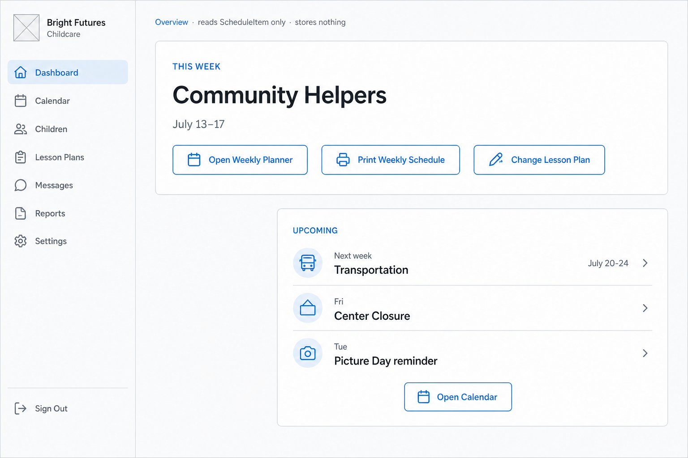
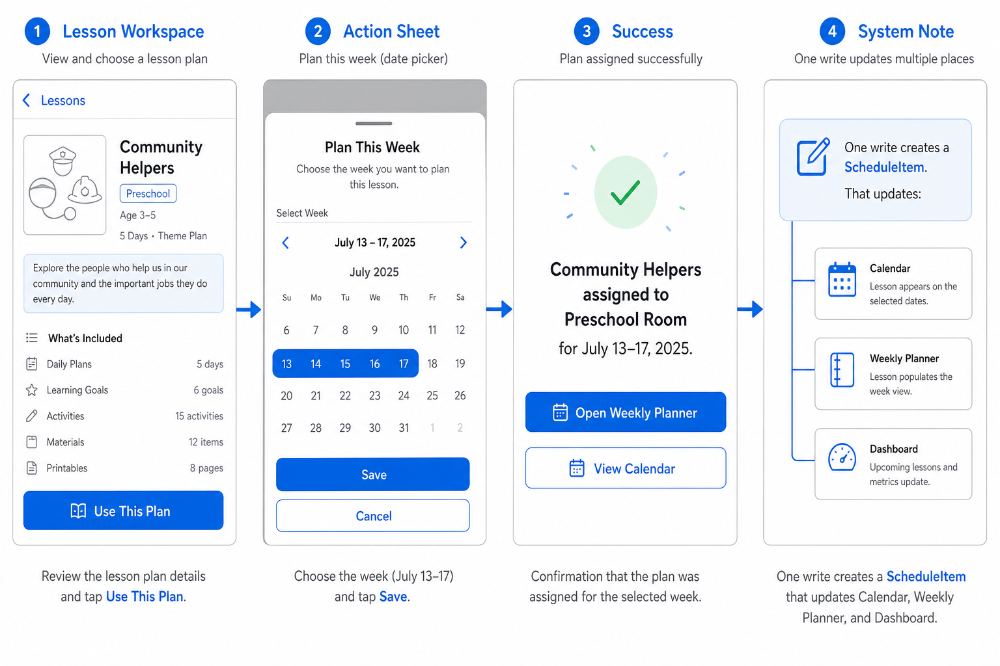

# Unified Scheduling — Visual Wireframes (Phase 1)

**Status:** Architecture approved (Option A). Wireframes delivered.  
**Design system:** See [`../design-system/`](../design-system/LLH_DESIGN_SYSTEM.md) — lavender primary, warm educational SaaS.  
**Date:** July 13, 2026  
**Audience:** Owner review  

> Layout/IA in these wireframes stays approved. **Visual color chrome** for build should follow the design system (lavender-led), not the earlier blue-leaning mockups.  

## Approved principles (locked)

1. One source of truth → cloud-backed **ScheduleItem**
2. **Main Calendar** = planning
3. **Weekly Planner** = execution (generated from ScheduleItem)
4. **Dashboard** = overview only (stores nothing)
5. **Lesson Library** = catalog → one assign write
6. One assignment updates every view

## Phase 1 item types (only)

- Lesson-plan assignments  
- Classroom events  
- Closures  
- Reminders  

## Explicitly not in Phase 1 UI

Multi-center, director/staff permissions, parent calendar, staff events, birthdays, form deadlines — **design hooks only, not shown as primary UI.**

Home daycare assumption for these wireframes: **one default classroom**, no classroom picker.

---

## How users move between screens

**Rule of thumb**

| From | Primary next step |
|------|-------------------|
| Dashboard | Run the week → Weekly Planner · Plan ahead → Calendar |
| Main Calendar | Plan months · Assign / change weeks · Open Weekly Planner for a week |
| Weekly Planner | Execute this week · Print · Jump back to Calendar to change plan |
| Lesson Library | Pick content → assign once → land in Weekly Planner |

---

## 1. Main Calendar (planning)

### Purpose
Official schedule. Future weeks, lesson plans, classroom events, closures, reminders.

### Layout
- Month grid (planning horizon)
- Week bars for assigned lesson themes (e.g. Community Helpers / Transportation / Back to School)
- Small chips for reminders / closures / classroom events
- Week detail panel: title, date range, actions

### Primary actions
- **Open Weekly Planner** — execution for that week  
- **Change Lesson Plan** — replace ScheduleItem lesson assignment  
- **Add Event** — classroom event / closure / reminder (Phase 1 types)

### Does not
- Run day checklists  
- Store teacher execution notes as the primary job (those live on the week’s execution overlay, edited in Weekly Planner)

---

## 2. Weekly Planner (execution)

### Purpose
Classroom working document for the assigned week — generated from the ScheduleItem.

### Layout
- Header: theme + date range (from ScheduleItem)
- Mon–Fri activity checklist from lesson snapshot
- Teacher Notes / Observation Notes
- Print Weekly Schedule

### Primary actions
- Check off activities / add notes  
- **Print Weekly Schedule** (keep existing PDF purpose)  
- **Change on Calendar** — does not invent a second assign system  

### Empty state (no ScheduleItem for week)
“No lesson plan assigned for this week.”  
→ **Assign from Library** or **Open Calendar**

### Does not
- Become a second assignment store  
- Act as the month planning calendar  

---

## 3. Dashboard (overview)

### Purpose
Quick glance. **Stores nothing.** Reads ScheduleItem only.

### THIS WEEK
- Theme / title  
- Date range  
- Buttons: Open Weekly Planner · Print Weekly Schedule · Change Lesson Plan  

### UPCOMING
- Next week’s lesson plan  
- Near-term classroom events / closures / reminders  
- Button: **Open Calendar**

### Does not
- Edit assignments inline (Change Lesson Plan goes to Library / Calendar flow)  
- Show Curriculum Planner as the primary path  

---

## 4. Lesson assignment flow (one write)

### Exact steps

1. **Lesson Workspace** → **Use This Plan**  
2. **Plan This Week** → pick week (no classroom picker for single-room)  
3. **Save** → creates / updates one **ScheduleItem** (`lesson_plan`)  
4. Success:  
   `“Community Helpers assigned to Preschool Room for July 13–17.”`  
5. CTAs: **Open Weekly Planner** (default) · **View Calendar**

### After one write, all update
- Main Calendar week bar  
- Weekly Planner content for that week  
- Dashboard THIS WEEK / UPCOMING  
- Library “Assigned” state  

### Collapsed verbs (do not ship as separate systems)
~~Add to Weekly Planner~~ · ~~Add to Main Calendar~~ · ~~Assign in Curriculum Planner~~  
→ single **Plan This Week / Assign** path.

---

## Screen-to-screen journey examples

### A. Teacher starts Monday morning
1. Opens **Dashboard** → sees Community Helpers  
2. Taps **Open Weekly Planner**  
3. Runs checklists / notes / prints schedule  

### B. Director/provider plans August (same UI; single classroom in Phase 1)
1. Opens **Main Calendar** → August  
2. Assigns week themes via Library or week detail **Change Lesson Plan**  
3. Adds closure Friday Aug 22  
4. Later, that week’s Weekly Planner generates automatically from ScheduleItem  

### C. Browse → assign → run
1. **Lesson Library** → open Community Helpers  
2. **Use This Plan** → **Plan This Week** → Save  
3. Lands in **Weekly Planner**  
4. Dashboard and Calendar already show the same assignment  

---

## Interactive clickable wireframes

Open locally (after `npm start` or any static server):

[`interactive.html`](./interactive.html)

Screens are clickable so you can walk Dashboard ↔ Calendar ↔ Weekly Planner ↔ Library assign flow without product code.

---

## Curriculum Planner (reminder)

Still present in the live app. **Not deleted.**  
These wireframes show the **target** IA. Retirement happens only after ScheduleItem migration (see architecture doc R0–R5).

---

## Approval ask for this wireframe pass

Please confirm or mark edits on:

- [ ] Main Calendar month + week detail is the right planning chrome  
- [ ] Weekly Planner as execution checklist + notes + print  
- [ ] Dashboard THIS WEEK / UPCOMING only  
- [ ] Library flow: Use This Plan → Plan This Week → success → Weekly Planner  
- [ ] No classroom picker in Phase 1 home-daycare path  

After wireframe approval → implementation begins with **cloud ScheduleItem foundation** (Option A).
